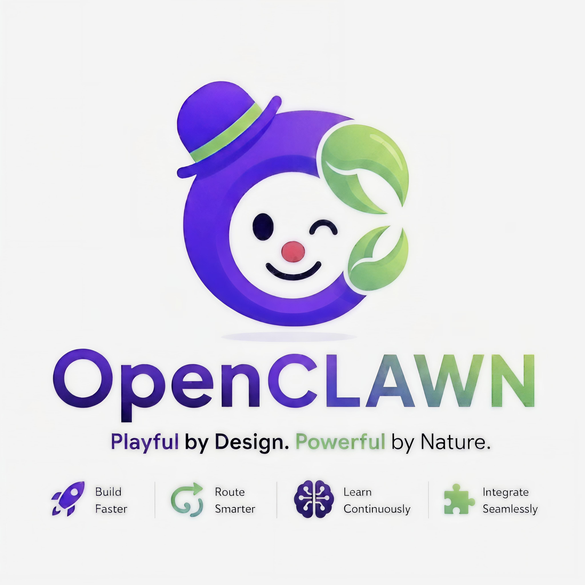
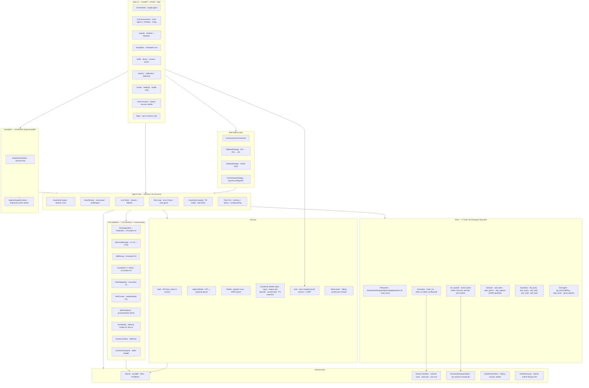
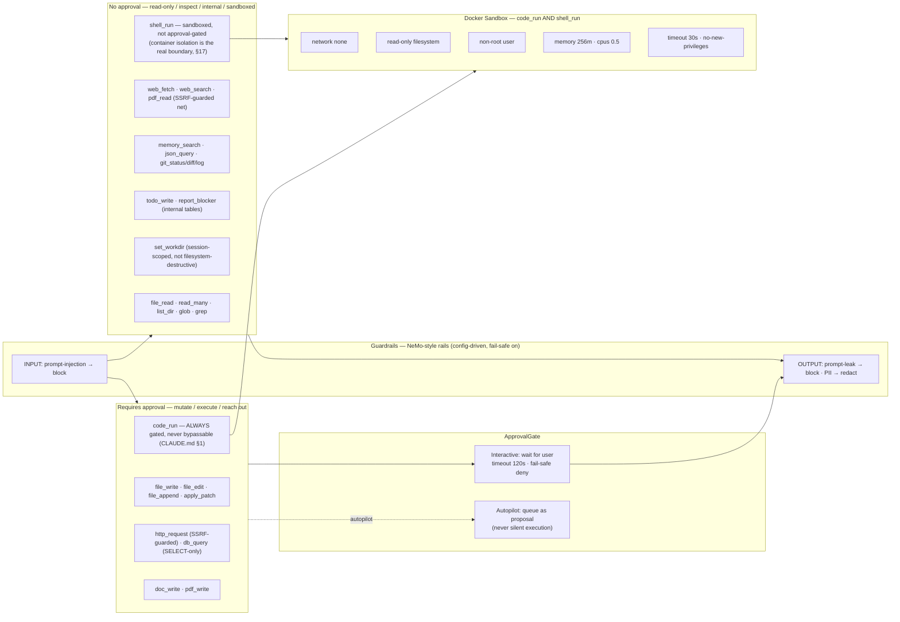
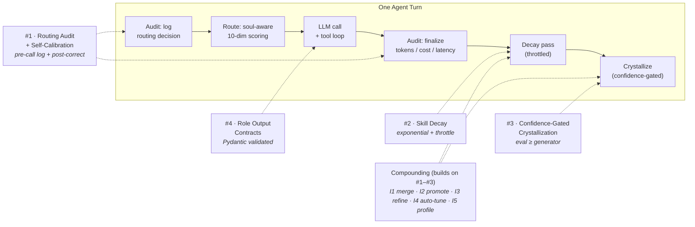
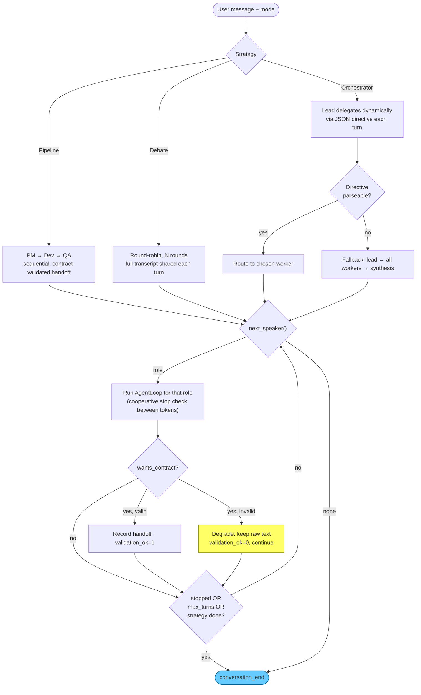

<div align="center">
  

  <h1>OpenCLAWN</h1>
  <p><strong>The Open-Source Control Plane for Trusted AI Agents.</strong></p>
  <p>Policy-before-dispatch, human-approval checkpoints, and immutable audit evidence — built in, not bolted on.</p>

  <p>
    <strong>Policy-Before-Dispatch</strong> · <strong>Human-Approval Checkpoints</strong> · <strong>Immutable Audit Evidence</strong>
  </p>

  <p>
    
    
    
    
    
    
  </p>
</div>

---

## What is OpenCLAWN?

By 2026, the AI agent market shifted: multi-agent orchestration, tool calling, and RAG became
table stakes — nearly every framework has them. What enterprises are actually buying now is
**governance**: the ability to run an AI worker safely, with a paper trail, and stop it before
it does something wrong. That gap is real — [research on 2026 enterprise adoption](https://agenticaiinstitute.org/agentic-ai-enterprise-adoption-2026-governance-gap/)
found 72% of organizations already run agentic AI in production, but only 21% have a mature
governance model for it.

OpenCLAWN is built to close exactly that gap. It's a **control plane** — the layer that decides
whether an agent's action is allowed, that stops it for a human when the rule says so, and that
proves after the fact what happened and why — sitting on top of the agent logic itself:

| What it does | How |
|---|---|
| **Policy-Before-Dispatch** | Every tool call carries `requires_approval`; nothing destructive runs before the policy check clears |
| **Human-Approval Checkpoints** | Approval is a blocking gate in the loop, not a log line after the fact — the agent stops and waits |
| **Immutable Audit Evidence** | Every routing decision, tool call, and skill promotion is logged **before** it happens and finalized **after** — a real paper trail, not best-effort logging |

Underneath that, **4 core innovations** most agent frameworks skip make the control plane self-improving instead of static:

| Innovation | Problem Solved |
|---|---|
| **Routing audit + self-calibration** | No agent records *why* a routing decision was made or whether it was correct |
| **Skill decay** | Skill trees accumulate forever — stale skills pollute context |
| **Confidence-gated crystallization** | Self-evolving agents store skills from bad solutions |
| **Role output contracts** | Multi-agent handoffs without typed contracts are fragile |

Built on top of those, the agent **compounds** — the skill library tidies and improves itself
as it's used, all gated and reversible:

| Capability | What it does |
|---|---|
| **Multi-agent conversation** | Pipeline / debate / orchestrator where roles hand off with validated contracts; live stop & interject |
| **Skill compounding** | Skills get promoted when proven, refined when corrected, and merged when duplicate (all versioned & revertible) |
| **Autopilots** | Scheduled agent runs — read-only; actions needing approval become *proposals*, never silent execution |
| **Skill packs** | Export/import skills between installs (Markdown + hash), imported as `draft` behind SSRF + injection guards |
| **Activity timeline** | Chronological view of every agent action across routing, tools, handoffs, conversations |
| **Multilingual routing** | Language-agnostic complexity signals + optional script-aware tier bump |
| **Guardrails** | NeMo-style input/output rails (native, no LangChain): block prompt-injection, block system-prompt leaks, redact PII — config-toggleable, fail-safe on |

**Stack:** Python 3.12 · FastAPI · HTMX · SQLite (aiosqlite) · Ollama + Gemini + Claude · httpx · Pydantic · structlog · tenacity

---

## Why not just use LangChain / CrewAI / AutoGen?

Those frameworks are good at what they do — orchestrating the agent loop, tool calling,
multi-agent coordination. But a 2026 comparative analysis of the space put it plainly:

> "None of them governs risky actions before they hit production — pair your pick with an
> agent control plane for policy, approvals, and audit... you still need policy-before-dispatch,
> explicit human approval states, and audit evidence."
> — [LangGraph vs CrewAI vs AutoGen, 2026 enterprise comparison](https://pub.towardsai.net/langgraph-vs-crewai-vs-autogen-which-ai-agent-framework-should-your-enterprise-use-in-2026-3a9ebb407b09)

That's precisely the gap OpenCLAWN's 4 core innovations close:

| Gap the analysis names | How OpenCLAWN answers it |
|---|---|
| No policy-before-dispatch | Every tool declares `requires_approval`; `code_run` can **never** bypass it (enforced at two independent points, not one) |
| No explicit human approval states | Approval is a blocking node in the agent loop (`security/approval.py`) — the agent waits, it doesn't just log and proceed |
| No audit evidence | Routing decisions are logged **before** the LLM call and finalized **after** (`core/audit.py`) — not best-effort, structured for replay |

This isn't a claim that OpenCLAWN is "better" at agent orchestration than those frameworks —
it's a narrower, more honest one: they don't ship a governance layer, and OpenCLAWN's core
design *is* one. [`"agent control plane"`](https://www.ibm.com/think/topics/agent-control-plane)
is itself now an established market category — GitHub, Google, and Microsoft all shipped
products under that name in 2026 — and this is where OpenCLAWN sits, self-hosted and
open-source instead of a vendor platform.

**What OpenCLAWN is *not*, to be equally direct:** it does not have an event-driven runtime,
multi-tenant isolation, or OAuth/SSO yet — these are tracked as future work, not silently
skipped. It is honest about being single-user-per-deployment today, not a finished
multi-tenant product (see [Scope & Production Posture](#scope--production-posture) below).

---

## Quick Start

```bash
git clone https://github.com/MuhammadHasbiAshshiddieqy/OpenClawn.git
cd OpenClawn

# Recommended: uv with the committed lockfile (reproducible, identical to CI)
uv sync --frozen --extra dev

# Or with pip
python -m venv .venv && source .venv/bin/activate
pip install -e ".[dev]"

# Create .env from example
cp .env.example .env
# Fill in keys: GEMINI_API_KEY and/or ANTHROPIC_API_KEY (heavy tiers)
# Local-only is fine too — Ollama handles light tiers without any key

# Run database migration
mkdir -p data
sqlite3 data/openclawn.db < migrations/001_initial.sql

# Pull Ollama models — one per local tier (or just gemma4:e4b to start)
ollama pull gemma4:e2b
ollama pull gemma4:e4b
ollama pull gemma4:12b

# Build sandbox image for code_run / shell_run
docker build -t openclawn-sandbox:latest -f Dockerfile.sandbox .

# Start the app
uvicorn web.main:app --reload --port 8000
```

Open **http://localhost:8000** to chat · **http://localhost:8000/metrics** for the routing calibration dashboard.

---

## Architecture

### Component Overview



### Full Agent Flow — One Turn

```mermaid
flowchart TD
    U(["User sends message via Web UI"]) --> SHIELD

    subgraph PRE["0 · Input Processing"]
        SHIELD{"Guardrails — INPUT rails<br/>injection scan (Shield + NFKD)<br/>config-driven, fail-safe on"}
        SHIELD -->|blocked| REJECT["Rejected"]
        SHIELD -->|clean| CORRECT
        CORRECT{"Check correction<br/>from previous turn?"}
        CORRECT -->|"yes: had_correction=1"| RESOLVE
        CORRECT -->|no| RESOLVE
        RESOLVE["SkillFeedback.resolve_previous()<br/>success &rarr; revive + promote draft (I2)<br/>corrected &rarr; reset + refine skill (I3)"]
        RESOLVE --> LOAD_SKILL
    end

    subgraph MEM["1 · Memory Loading"]
        LOAD_SKILL["Load active skills<br/>SkillDecay: score &gt; 0.3,<br/>max 8 + 1 draft trial (I2)"]
        LOAD_SKILL --> LOAD_CTX["Load memory context<br/>L1: state · L2: facts · L3: skills<br/>L4: FTS5 archive · User profile (I5, opt-in)"]
    end

    subgraph BUILD["2 · Context Building"]
        LOAD_CTX --> COMPACT["ContextCompactor.build()<br/>system + memory + history<br/>+ message, within budget"]
    end

    subgraph ROUTE["3 · Routing Decision"]
        COMPACT --> DIMS["10 dimensions scored<br/>(+ has_code_signal · query_script)"]
        DIMS --> SOUL{"soul.toml<br/>upgrade_kw hit?"}
        SOUL -->|"yes: +3 score"| PREFER
        SOUL -->|no| PREFER
        PREFER{"prefer_local?"}
        PREFER -->|"yes: threshold +1<br/>stay local longer"| LANG
        PREFER -->|"no: normal threshold"| LANG
        LANG{"language bump?<br/>(opt-in)"}
        LANG -->|"script outside local<br/>threshold -1: bump tier"| LABEL
        LANG -->|"local script / off"| LABEL
        LABEL["Complexity label (+ calibration offset)<br/>TRIVIAL &rarr; SIMPLE &rarr; MODERATE<br/>&rarr; COMPLEX &rarr; CRITICAL"]
        LABEL --> OVERRIDE{"/settings<br/>override active?"}
        OVERRIDE -->|yes| USE_OV["Use chosen model<br/>(audit still logs router decision)"]
        OVERRIDE -->|no| USE_ROUTE["Use router model<br/>(/router tier&rarr;model map)"]
    end

    subgraph AUDIT1["4 · Pre-Call Audit — innovation #1"]
        USE_OV --> LOG["Auditor.log_decision()<br/>10 dims + score + label<br/>+ model + reason &rarr; DB"]
        USE_ROUTE --> LOG
    end

    subgraph LLM["5 · LLM Call with Fallback"]
        LOG --> STREAM["LLMClient.stream_with_fallback()"]
        STREAM --> HEALTH{"Ollama health check"}
        HEALTH -->|up| PRIMARY["Try primary model"]
        HEALTH -->|down| FALL["Fallback chain"]
        PRIMARY -->|error| FALL
        FALL --> F1["1 · gemma4:e4b (local)"]
        F1 -->|error| F2["2 · deepseek-r1 (local)"]
        F2 -->|error| F3["3 · qwen3.5:9b (local)"]
        F3 -->|error| F4["4 · gemini-2.5-flash (cloud)"]
        F4 -->|error| FAIL["ProviderUnavailable"]
    end

    subgraph TOOL_LOOP["6 · Iterative Tool Loop — max 5 hops"]
        PRIMARY --> PARSE{"Tool call in stream?"}
        FALL --> PARSE
        PARSE -->|"tool_call found"| LOOPGUARD
        PARSE -->|"text only"| YIELD["Yield text to user"]
        YIELD --> DONE_CHECK{"Another tool call?"}
        DONE_CHECK -->|no| GUARD_OUT
        LOOPGUARD{"Same call<br/>repeated 2&times;?"}
        LOOPGUARD -->|yes| HALT["Loop halted<br/>(hard break)"]
        LOOPGUARD -->|no| ALLOWED
        HALT --> GUARD_OUT
        ALLOWED{"Role allowed?"}
        ALLOWED -->|no| ERR2["Tool denied"]
        ALLOWED -->|yes| APPROVAL{"requires_approval?"}
        APPROVAL -->|no| RUN_TOOL["Run tool"]
        APPROVAL -->|yes| AUTOMODE{"autopilot mode?"}
        AUTOMODE -->|"yes: queue proposal<br/>(no silent execution)"| TOOL_RESULT
        AUTOMODE -->|no| HITL{"User approves?"}
        HITL -->|reject/timeout| ERR3["Approval denied"]
        HITL -->|approve| RUN_TOOL
        ERR2 --> TOOL_RESULT
        ERR3 --> TOOL_RESULT
        RUN_TOOL --> TOOL_RESULT["Result &rarr; append to messages"]
        TOOL_RESULT --> HOP{"hop &lt; 5?"}
        HOP -->|yes| PRIMARY
        HOP -->|no| GUARD_OUT
    end

    subgraph POST["7 · Post-Turn Processing — throttled, non-blocking"]
        GUARD_OUT{"Guardrails — OUTPUT rails<br/>on full turn.content<br/>before it is stored"}
        GUARD_OUT -->|"prompt-leak"| GBLOCK["Block: replace with safe message"]
        GUARD_OUT -->|"PII match"| GREDACT["Redact &rarr; [REDACTED]"]
        GUARD_OUT -->|clean| FINALIZE
        GBLOCK --> FINALIZE
        GREDACT --> FINALIZE
        FINALIZE["Auditor.finalize()<br/>tokens, cost, latency &rarr; DB"]
        FINALIZE --> WRITE_MEM["MemoryManager<br/>L1 checkpoint · L4 archive (if threshold)"]
        WRITE_MEM --> DECAY_PASS["SkillDecay.maybe_run_decay_pass()<br/>throttled: 1&times;/hour"]
        DECAY_PASS --> RECORD["SkillFeedback.record_usage()<br/>(skills used this turn &rarr; next-turn outcome)"]
        RECORD --> CURATE["SkillCurator.maybe_run_curation_pass() (I1)<br/>merge duplicates · judge &ge;4 · revertible"]
        CURATE --> AUTOTUNE["Calibration.maybe_auto_apply() (I4)<br/>opt-in · clamp &plusmn;1 · revertible"]
        AUTOTUNE --> USERMOD["UserModel.maybe_update() (I5)<br/>opt-in · versioned"]
        USERMOD --> CRYST_CHECK{"Crystallizer<br/>should_attempt?<br/>(&ge;3 tool calls)"}
        CRYST_CHECK -->|yes| SELF_EVAL["Self-evaluate<br/>evaluator &ge; generator<br/>confidence 1–5"]
        SELF_EVAL --> STORE{"conf &ge; 4 AND<br/>no critical gaps?"}
        STORE -->|yes| ACTIVE["Store as active skill"]
        STORE -->|no| DRAFT["Store as draft<br/>(not auto-injected)"]
        CRYST_CHECK -->|no| DONE
        ACTIVE --> DONE
        DRAFT --> DONE
        DONE(["Turn complete"])
    end

    style REJECT fill:#f66,stroke:#900,color:#fff
    style FAIL fill:#f66,stroke:#900,color:#fff
    style HALT fill:#f66,stroke:#900,color:#fff
    style GBLOCK fill:#f66,stroke:#900,color:#fff
    style GREDACT fill:#ff6,stroke:#990
    style ACTIVE fill:#6f6,stroke:#090
    style DRAFT fill:#ff6,stroke:#990
    style DONE fill:#6cf,stroke:#069
```



### Tools & Security

All 27 tools are **workspace-bounded** — every file path is resolved with `Path.resolve()`
and rejected if it escapes the workspace root (defeats `../` and symlink escape). Tools that
mutate state or run code require explicit approval.

Around the whole turn sit **guardrails** (NeMo-style, native — no LangChain): **input rails**
scan the user message for prompt-injection before the pipeline runs; **output rails** check the
full response before it is stored — blocking system-prompt leaks and redacting PII (email, card,
API key). Each rail is config-toggleable and **fail-safe on** (corrupt/missing config → all rails active).



> **Security note:** `code_run` and `shell_run` **never execute on the host** — both run inside
> the Docker sandbox. If Docker is unavailable, they fail safe (return an error) rather than
> falling back to host execution. Only `code_run` requires human approval — `shell_run` doesn't,
> because the sandbox (not the approval click) is the real security boundary for both; `code_run`
> stays gated regardless because arbitrary code execution is treated as strictly higher-risk than
> a shell command, and that gate can never be bypassed (not even by trust mode). `db_query` is
> SELECT-only. `web_fetch`/`http_request` pass an anti-SSRF guard (reject loopback, private,
> link-local incl. cloud metadata). In **autopilot** mode, approval-gated tools are queued as
> proposals for later review — never run unattended.
> **Guardrails** wrap the turn: input rails block injection before the pipeline; output rails
> run on the full response before storage — blocking system-prompt leaks and redacting PII so it
> never reaches stored memory (L1/L4). Note: tokens already streamed can't be unsent — output
> rails operate on the complete `turn.content` to keep PII out of storage and flag the UI.

### The 4 Innovations — Where They Fire



### Multi-Agent Conversation

Beyond single-agent turns, roles can **talk to each other**. One orchestrator loop drives three
pluggable strategies; each turn is a full agent run (routing, tools, memory all intact). You can
**stop** mid-conversation or **interject** with your own message, counted on the next turn.



---

## The 4 Core Innovations

### 1. Routing Audit + Self-Calibration
Every routing decision is logged **before** the LLM call with 10 dimensions (token count, tech keywords, soul upgrade hits, a language-agnostic code signal, detected script, etc.) and updated **after** with latency, cost, and correction signals. The `/metrics` dashboard shows which complexity labels have the highest correction rate — letting you tune the router with real data.

### 2. Skill Decay
Skills age with **exponential decay** (`score × 0.97^days_since_used`). Unused skills drop below 0.3 and get archived. A revived skill recovers score immediately. Decay runs throttled (max once per hour) so it never blocks a turn.

### 3. Confidence-Gated Crystallization
After a successful multi-step task, the agent evaluates its own solution using a model **at least as capable as the generator** (`EVALUATOR_FOR` map: e4b→12b, Sonnet→Sonnet). Solutions with confidence < 4/5 or critical gaps are stored as `draft`, not `active`, and never injected into future context automatically.

### 4. Role Output Contracts
Handoffs between roles (PM → QA → Dev) use Pydantic models as typed contracts. Invalid output is stored with `validation_ok=0` for debugging — no crash, no silent data loss.

---

## LLM Routing

The router scores 10 dimensions, then maps a complexity label to a model. Light tiers stay
**local** (Ollama, free, private); heavy tiers escalate to a **cloud** model. The exact mapping
is configurable. Local tiers are ordered **by model capacity** (harder case → more capable
model); heavy tiers go to the cloud. The shipped default:

```
Query complexity → model selection:

TRIVIAL  → gemma4:e4b          (Ollama · local, lightest)
SIMPLE   → deepseek-r1         (Ollama · local, reasoning)
MODERATE → qwen3.5:9b          (Ollama · local, most capable)
COMPLEX  → gemini-2.5-flash    (cloud)   # or claude-haiku-4-5
CRITICAL → gemini-2.5-pro      (cloud)   # or claude-sonnet-4-6
```

Cloud tiers are pluggable: point them at **Gemini** or **Claude** depending on the API key you
provide. The shipped default routes heavy tiers to Gemini; swap to Claude in `core/router.py` if
you prefer. Local tiers are easy to remap too — just edit the `MODELS` dict.

The router is **soul-aware**: each role's `soul.toml` can define `upgrade_keywords` that force
higher complexity, and `prefer_local=true` to resist escalating to the cloud. Soul upgrade
keywords **override** `prefer_local` — the soul has higher priority.

If Ollama is offline, the client falls back down the chain automatically
(`gemma4:e4b → deepseek-r1 → qwen3.5:9b → gemini-2.5-flash`). Every fallback is logged to the
audit DB.

---

## Project Structure

```
openclawn/
├── core/           # agent_loop · llm_client · router (multilingual) · audit · calibration
│                   # crystallizer · compactor · conversation (multi-agent)
│                   # activity (timeline) · autopilot (scheduler) · skill_pack · tool_audit
├── infra/          # config · database (WAL, POWER()) · logging · env · workspace
├── memory/         # layers (L1–L4) · skill_decay · curator (merge) · skill_feedback
│                   # user_model · search (FTS5)
├── roles/          # pm/qa/dev/data/security soul.toml · contracts (Pydantic) · registry
├── tools/          # 27 tools: file_ops · read_many · search · shell · code · web · git
│                   # document (pdf_read · doc_write · pdf_write) · todo · report_blocker
├── security/       # vault · shield (NFKD) · guardrails (NeMo-style rails) · approval
│                   # (HITL + proposal queue) · question · skill_scanner
├── web/            # FastAPI app · HTMX templates · SSE · /activity /autopilots /skills
├── migrations/     # 001_initial.sql
└── tests/          # 490 tests — innovations, tools, web, compounding, guardrails
```

The 4 core innovations are stable; everything above (multi-agent, autopilots, skill
compounding, skill packs) builds on them. See [CHANGELOG.md](CHANGELOG.md) for the full
feature history.

```text
(structure continued — key runtime pages)
/                  chat · single & multi-agent modes
/activity          timeline of agent actions + open blockers
/autopilots        scheduled runs + pending proposals
/skills            decay curves · crystallization · curation · skill packs
/metrics           routing calibration · tool telemetry
/conversations     multi-agent transcripts
/router · /settings  tier→model map · model override
```

---

## Running Tests

```bash
pytest tests/ -v
```

All tests use in-memory SQLite and mocked LLM calls — no real Ollama, Gemini, or Claude API needed.

---

## Documentation

Detailed reference for every module, class, and function:

| Folder | Doc |
|---|---|
| `infra/` | [docs/infra.md](docs/infra.md) — config, database, logging |
| `core/` | [docs/core.md](docs/core.md) — agent loop, LLM client, router (multilingual), audit, crystallizer, calibration, conversation, activity, autopilot, skill packs |
| `memory/` | [docs/memory.md](docs/memory.md) — L1–L4 layers, skill decay, curator (merge), skill feedback (promote/refine), user model, FTS5 search |
| `roles/` | [docs/roles.md](docs/roles.md) — contracts, role registry, soul.toml format |
| `security/` | [docs/security.md](docs/security.md) — vault, shield, guardrails (NeMo-style rails), approval gate HITL, skill scanner |
| `tools/` | [docs/tools.md](docs/tools.md) — 27 tools, permission matrix, Docker sandbox |
| `web/` | [docs/web.md](docs/web.md) — FastAPI endpoints, SSE streaming |
| Database | [docs/database.md](docs/database.md) — full schema + example queries |
| Tests | [docs/tests.md](docs/tests.md) — test index + patterns |
| OpenConnector integration | [docs/tools.md](docs/tools.md#integrasi-openconnector-third-party-opsional) — connect 1000+ SaaS providers via MCP |

---

## Sprint Status

| Sprint | Focus | Status |
|---|---|---|
| 0 | Infra · LLM client · Agent loop · Web UI · Audit | Done |
| 1 | Soul-aware router · Memory L1–L4 · Compactor + caching | Done |
| 2 | Tools · Docker sandbox · Crystallizer · Skill decay | Done |
| 3 | Role contracts · Vault · Shield · ApprovalGate (HITL) | Done |
| 4 | Coverage · Calibration advisor · (router tuning needs live data) | Ongoing |
| 5 | Multi-agent conversation · Gemini provider · UI redesign | Done |
| 5+ | Tooling to 26 (git · todo · docs · pdf · blocker) · SSRF guard · CI + uv.lock | Done |
| 5++ | Autopilots (scheduled, proposal-gated) · Activity timeline · Skill packs | Done |
| 6–8 | Compounding intelligence: skill curator · draft promotion · refine · guarded auto-apply · user model | Done |
| — | Multilingual routing (structural + script-aware signals) | Done |
| — | MCP client (external tools, approval-gated) · `/health` · stale-draft cleanup | Done |
| — | Guardrails (NeMo-style input/output rails: injection · prompt-leak · PII redaction) | Done |

---

## Design Principles

- **Security first** — `code_run` and `shell_run` only run inside Docker (`network none`, `read-only`, non-root, timeout); they never touch the host. Web tools have an anti-SSRF guard; autopilots never execute approval-gated actions (they queue proposals). Input/output guardrails (NeMo-style, native) wrap every turn — fail-safe on
- **Workspace-bounded** — every file tool resolves paths and rejects escapes outside the workspace root
- **No SDK** — raw `httpx` for all LLM calls, intentional for audit transparency
- **Token-first** — context budget tracked; prompt caching on stable system blocks
- **No hardcoded domain/locale** — locale via field & config, not in code (routing keywords moved out of core)
- **Gated, versioned, reversible** — self-improvement (merge/refine/promote/auto-tune) always behind confidence gates, with audit trails and revert
- **Every innovation = extractable module** — `skill_decay`, `audit`, `crystallizer`, `contracts`, `curator`, `activity`, `guardrails` have clean interfaces

---

## Scope & Production Posture

OpenCLAWN targets **single-user, self-hosted** use (research/experiment phase). Several
things a multi-user SaaS would need are **intentionally out of scope** — they are design
decisions, not technical debt:

| Not included | Why (deliberate) |
|---|---|
| Multi-user accounts | Single-user by design — one shared login for the one operator, not a user system |
| PostgreSQL / horizontal scaling | SQLite (WAL) is sufficient for one user; no multi-instance state |
| Multi-tenancy | One workspace, one user |

Adopting these would change the project's identity, so they are not on the roadmap unless
that direction is chosen explicitly.

### Self-hosting on a public VPS (opt-in hardening)

By default (`OPENCLAWN_AUTH_TOKEN` unset) OpenCLAWN runs with **no login** — correct for
localhost or a VPN/Tailscale overlay, where the network boundary *is* the access control.
If you expose it on a public IP, enable the built-in hardening first:

1. **Set `OPENCLAWN_AUTH_TOKEN`** in `.env` (see `.env.example`) — a single shared password
   gate. Requests without a valid session are redirected to `/login`; no session state is
   kept server-side (signed cookie, HMAC-SHA256, pure stdlib — no new dependency).
2. **Put a TLS reverse proxy in front** — see `Caddyfile.example` (auto Let's Encrypt).
   Never bind uvicorn directly to a public IP without TLS; credentials and chat content
   would travel in plaintext.
3. **CSRF is enforced automatically** once `OPENCLAWN_AUTH_TOKEN` is set — every POST form
   carries a signed token validated server-side.
4. **Rate limiting is on automatically** for `/chat/stream` and `/converse/stream` (in-memory
   sliding window, no Redis needed — single-process is enough for one user).
5. **`/health`** now also reports Ollama reachability, which cloud API keys are configured,
   and whether auth is enabled — wire it into your process manager or `docker-compose`
   healthcheck (already configured in `docker-compose.yml`).
6. **Back up the database on a schedule** — `data/openclawn.db` has no automatic backup by
   default. Use `scripts/backup_db.py` (wraps SQLite's Online Backup API, safe to run while
   the server is live under WAL mode):
   ```bash
   python scripts/backup_db.py --keep 14   # backup now, keep the 14 newest
   python scripts/backup_db.py --list       # show existing backups
   ```
   Schedule it with cron (`0 3 * * * cd /path/to/openclawn && .venv/bin/python
   scripts/backup_db.py --keep 14`) or a systemd timer — an example unit is documented at the
   bottom of the script. Restore is a straight file copy: stop the server, replace
   `data/openclawn.db` with the chosen backup file, restart.

None of this turns OpenCLAWN into a multi-tenant product — it is still one operator, one
password, one workspace. It closes the gap between "safe on a trusted network" and "safe to
expose on the open internet" for that one operator.

**What "production-ready" means here** (for single-user self-hosting): reliable for one
person, safely reachable from the internet if you choose to. That posture is met —
Docker-sandboxed execution, SSRF guard, HITL approval, fail-safe error handling, CI on every
push, opt-in auth + CSRF + rate limiting, a dependency-aware `/health` endpoint, custom
error pages (no leaked stack traces), and stale draft-skill cleanup. Remaining polish is
tracked in [CHANGELOG.md](CHANGELOG.md).

> **Common review misread:** OpenCLAWN is *not* an under-built multi-user product. `shell_run`
> and `code_run` run **only** in the Docker sandbox (never on the host); the DB is never
> served statically; there are no `except: pass` swallows; CI exists. Evaluate it as a
> single-user framework, not a SaaS.

---

## Third-Party Integrations

**[OpenConnector](https://github.com/oomol-lab/open-connector)** by
[oomol-lab](https://github.com/oomol-lab), licensed under the
[Apache License 2.0](https://github.com/oomol-lab/open-connector/blob/main/LICENSE.txt).
An open-source auth gateway connecting 1,000+ SaaS providers (GitHub, Gmail,
Notion, Slack, and more) to AI agents via MCP, HTTP/OpenAPI, and SDK.

OpenCLAWN does not vendor or fork OpenConnector's code — it runs as an
independent Docker service (`docker-compose.yml`, opt-in `connector` profile)
and is connected purely as an external MCP server through the existing
`MCPRegistry`/`MCPTool` integration, same as any other MCP tool (always
`requires_approval=True`, no special-cased trust). See
[docs/tools.md § Integrasi OpenConnector](docs/tools.md#integrasi-openconnector-third-party-opsional)
for setup steps and [Caddyfile.example](Caddyfile.example) for exposing its
dashboard alongside OpenCLAWN in a self-hosted deployment.

Full credit to the OOMOL/oomol-lab team for OpenConnector. Provider names and
trademarks referenced through it belong to their respective owners.

---

## License

MIT — see [LICENSE](LICENSE)
