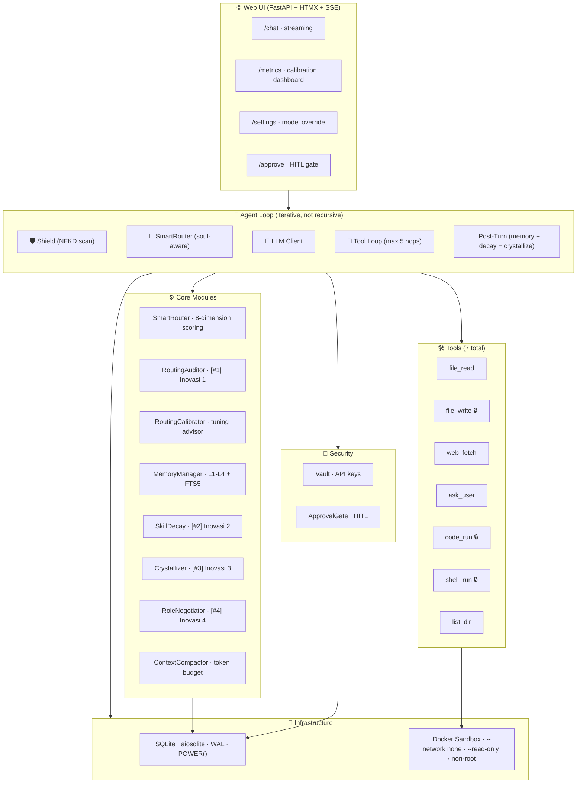
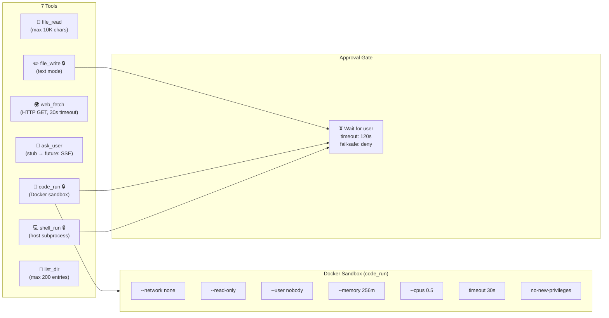
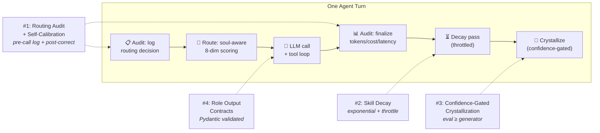

<div align="center">
  

  <h1>OpenCLAWN</h1>
  <p><strong>Playful by Design. Powerful by Nature.</strong></p>
  <p>Lightweight, safe, self-improving multi-role agent framework</p>

  <p>
    <strong>Route Smarter</strong> · <strong>Learn Continuously</strong> · <strong>Stay Safe</strong> · <strong>Hand Off Cleanly</strong>
  </p>

  <p>
    
    
    
    
  </p>
</div>

---

## What is OpenCLAWN?

OpenCLAWN is an agent framework built around **4 core innovations** that most agent frameworks skip:

| Innovation | Problem Solved |
|---|---|
| **Routing audit + self-calibration** | No agent records *why* a routing decision was made or whether it was correct |
| **Skill decay** | Skill trees accumulate forever — stale skills pollute context |
| **Confidence-gated crystallization** | Self-evolving agents store skills from bad solutions |
| **Role output contracts** | Multi-agent handoffs without typed contracts are fragile |

**Stack:** Python 3.12 · FastAPI · HTMX · SQLite (aiosqlite) · Ollama + Claude API · httpx · Pydantic · structlog · tenacity

---

## Quick Start

```bash
git clone https://github.com/MuhammadHasbiAshshiddieqy/OpenClawn.git
cd OpenClawn

python -m venv .venv && source .venv/bin/activate
pip install -e ".[dev]"

# Create .env from example
cp .env.example .env
# Fill in ANTHROPIC_API_KEY in .env

# Run database migration
mkdir -p data
sqlite3 data/openclawn.db < migrations/001_initial.sql

# Pull Ollama models
ollama pull gemma4:e2b
ollama pull gemma4:e4b
ollama pull gemma4:12b

# Build sandbox image for code_run
docker build -t openclawn-sandbox:latest -f Dockerfile.sandbox .

# Start the app
uvicorn web.main:app --reload --port 8000
```

Open **http://localhost:8000** to chat · **http://localhost:8000/metrics** for the routing calibration dashboard.

---

## Architecture

### Component Overview



### Full Agent Flow — One Turn

```mermaid
flowchart TD
    U(["👤 User sends message via Web UI"]) --> SHIELD

    subgraph PRE["0. Input Processing"]
        SHIELD{"🛡 Shield<br/>NFKD normalize<br/>+ danger pattern scan"}
        SHIELD -->|blocked| REJECT["❌ Rejected"]
        SHIELD -->|clean| CORRECT
        CORRECT{"🔍 Check correction<br/>from previous turn?"}
        CORRECT -->|"yes: mark had_correction=1"| LOAD_SKILL
        CORRECT -->|no| LOAD_SKILL
    end

    subgraph MEM["1. Memory Loading"]
        LOAD_SKILL["📥 Load active skills<br/>(SkillDecay: score > 0.3,<br/>max 8, trigger-matched)"]
        LOAD_SKILL --> LOAD_CTX["📥 Load memory context<br/>L1: last state<br/>L2: facts (importance-sorted)<br/>L3: active skills<br/>L4: FTS5 cross-session"]
    end

    subgraph BUILD["2. Context Building"]
        LOAD_CTX --> COMPACT["📦 ContextCompactor.build()<br/>system_prompt + memory +<br/>history + user_message<br/>within token budget"]
    end

    subgraph ROUTE["3. Routing Decision"]
        COMPACT --> DIMS["📐 8 Dimensions Scored"]
        DIMS --> SOUL{"soul.toml<br/>upgrade_kw hit?"}
        SOUL -->|"yes: +3 score"| PREFER
        SOUL -->|no| PREFER
        PREFER{"prefer_local?"}
        PREFER -->|"yes: threshold +1<br/>(stay local longer)"| LABEL
        PREFER -->|"no: normal threshold"| LABEL
        LABEL["🏷 Complexity Labeling<br/>TRIVIAL→SIMPLE→MODERATE<br/>→COMPLEX→CRITICAL"]
        LABEL --> OVERRIDE{"⚙ /settings<br/>override active?"}
        OVERRIDE -->|yes| USE_OV["Use chosen model<br/>(audit still logs router decision)"]
        OVERRIDE -->|no| USE_ROUTE["Use router model"]
    end

    subgraph AUDIT1["4. Pre-Call Audit [#1]"]
        USE_OV --> LOG["📋 Auditor.log_decision()<br/>8 dims + score + label +<br/>model + reason → DB"]
        USE_ROUTE --> LOG
    end

    subgraph LLM["5. LLM Call with Fallback"]
        LOG --> STREAM["📡 LLMClient.stream_with_fallback()"]
        STREAM --> HEALTH{"Ollama health check"}
        HEALTH -->|up| PRIMARY["Try primary model"]
        HEALTH -->|down| FALL["⬇ Fallback chain"]
        PRIMARY -->|error| FALL
        FALL --> F1["1. gemma4:12b"]
        F1 -->|error| F2["2. gemma4:e4b"]
        F2 -->|error| F3["3. claude-haiku-4-5"]
        F3 -->|error| FAIL["❌ ProviderUnavailable"]
    end

    subgraph TOOL_LOOP["6. Iterative Tool Loop (max 5 hops)"]
        PRIMARY --> PARSE{"Plaintext tool call<br/>detected in stream?<br/>(7 regex parsers)"}
        FALL --> PARSE
        PARSE -->|"tool_call found"| EXEC
        PARSE -->|"text only"| YIELD["📤 Yield text to user"]
        YIELD --> DONE_CHECK{"Another tool call?"}
        DONE_CHECK -->|no| FINALIZE
        EXEC["🔧 Execute tool"]
        EXEC --> ALLOWED{"Role allowed?"}
        ALLOWED -->|no| ERR2["❌ Tool denied"]
        ALLOWED -->|yes| APPROVAL{"requires_approval?"}
        APPROVAL -->|no| RUN_TOOL["⚡ Run tool"]
        APPROVAL -->|yes| HITL{"👤 User approves?"}
        HITL -->|reject/timeout| ERR3["❌ Approval denied"]
        HITL -->|approve| RUN_TOOL
        ERR2 --> TOOL_RESULT
        ERR3 --> TOOL_RESULT
        RUN_TOOL --> TOOL_RESULT["📎 Result → append to messages"]
        TOOL_RESULT --> HOP{"hop < 5?"}
        HOP -->|yes| PRIMARY
        HOP -->|no| FINALIZE
    end

    subgraph POST["7. Post-Turn Processing"]
        FINALIZE["📊 Auditor.finalize()<br/>tokens, cost, latency → DB"]
        FINALIZE --> WRITE_MEM["💾 MemoryManager<br/>L1 checkpoint update<br/>L4 archive (if threshold)"]
        WRITE_MEM --> DECAY_PASS["⏳ SkillDecay<br/>maybe_run_decay_pass()<br/>(throttled: 1x/hour)"]
        DECAY_PASS --> CRYST_CHECK{"Crystallizer<br/>should_attempt?<br/>(≥3 tool calls)"}
        CRYST_CHECK -->|yes| SELF_EVAL["🧪 Self-evaluate<br/>(evaluator ≥ generator)<br/>confidence 1-5"]
        SELF_EVAL --> STORE{"conf ≥ 4 AND<br/>no critical gaps?"}
        STORE -->|yes| ACTIVE["✅ Store as active skill"]
        STORE -->|no| DRAFT["📝 Store as draft<br/>(not auto-injected)"]
        CRYST_CHECK -->|no| DONE
        ACTIVE --> DONE
        DRAFT --> DONE
        DONE(["✅ Turn complete"])
    end

    style REJECT fill:#f66,stroke:#900
    style FAIL fill:#f66,stroke:#900
    style ACTIVE fill:#6f6,stroke:#090
    style DRAFT fill:#ff6,stroke:#990
    style DONE fill:#6cf,stroke:#069
```



### Tool Execution Detail



### The 4 Innovations — Where They Fire



---

## The 4 Core Innovations

### 1. Routing Audit + Self-Calibration
Every routing decision is logged **before** the LLM call with 8 dimensions (token count, tech keywords, soul upgrade hits, etc.) and updated **after** with latency, cost, and correction signals. The `/metrics` dashboard shows which complexity labels have the highest correction rate — letting you tune the router with real data.

### 2. Skill Decay
Skills age with **exponential decay** (`score × 0.97^days_since_used`). Unused skills drop below 0.3 and get archived. A revived skill recovers score immediately. Decay runs throttled (max once per hour) so it never blocks a turn.

### 3. Confidence-Gated Crystallization
After a successful multi-step task, the agent evaluates its own solution using a model **at least as capable as the generator** (`EVALUATOR_FOR` map: e4b→12b, Sonnet→Sonnet). Solutions with confidence < 4/5 or critical gaps are stored as `draft`, not `active`, and never injected into future context automatically.

### 4. Role Output Contracts
Handoffs between roles (PM → QA → Dev) use Pydantic models as typed contracts. Invalid output is stored with `validation_ok=0` for debugging — no crash, no silent data loss.

---

## LLM Routing

```
Query complexity → model selection:

TRIVIAL  → gemma4:e2b  (Ollama, local)
SIMPLE   → gemma4:e4b  (Ollama, local)
MODERATE → gemma4:12b  (Ollama, local)
COMPLEX  → claude-haiku-4-5-20251001  (Anthropic API)
CRITICAL → claude-sonnet-4-6          (Anthropic API)
```

The router is **soul-aware**: each role's `soul.toml` can define `upgrade_keywords` that force higher complexity, and `prefer_local=true` to resist escalating to the cloud. Soul upgrade keywords **override** `prefer_local` — the soul has higher priority.

If Ollama is offline, the client falls back down the chain automatically. Every fallback is logged to the audit DB.

---

## Project Structure

```
openclawn/
├── core/           # agent_loop · llm_client · router · audit · crystallizer · compactor
├── infra/          # config · database (WAL, POWER()) · logging (structlog JSON)
├── memory/         # layers (L1-L4) · skill_decay · search (FTS5)
├── roles/          # pm/qa/dev soul.toml · contracts (Pydantic) · registry
├── tools/          # file_read · file_write · web_fetch · code_run · ask_user
├── security/       # vault · shield (NFKD) · approval_gate
├── web/            # FastAPI app · HTMX templates · SSE streaming
├── migrations/     # 001_initial.sql
└── tests/          # test_router · test_fallback · test_skill_decay
                    # test_crystallizer · test_contracts
```

---

## Running Tests

```bash
pytest tests/ -v
```

All tests use in-memory SQLite and mocked LLM calls — no real Ollama or Claude API needed.

---

## Documentation

Detailed reference for every module, class, and function:

| Folder | Doc |
|---|---|
| `infra/` | [docs/infra.md](docs/infra.md) — config, database, logging |
| `core/` | [docs/core.md](docs/core.md) — agent loop, LLM client, router, audit, crystallizer, calibration |
| `memory/` | [docs/memory.md](docs/memory.md) — L1–L4 layers, skill decay, FTS5 search |
| `roles/` | [docs/roles.md](docs/roles.md) — contracts, role registry, soul.toml format |
| `security/` | [docs/security.md](docs/security.md) — vault, shield, approval gate HITL |
| `tools/` | [docs/tools.md](docs/tools.md) — file/web/code tools, Docker sandbox |
| `web/` | [docs/web.md](docs/web.md) — FastAPI endpoints, SSE streaming |
| Database | [docs/database.md](docs/database.md) — full schema + example queries |
| Tests | [docs/tests.md](docs/tests.md) — test index + patterns |

---

## Sprint Status

| Sprint | Focus | Status |
|---|---|---|
| 0 | Infra · LLM client · Agent loop · Web UI · Audit | ✅ Done |
| 1 | Soul-aware router · Memory L1-L4 · Compactor + caching | ✅ Done |
| 2 | Tools · Docker sandbox · Crystallizer · Skill decay | ✅ Done |
| 3 | Role contracts · Vault · Shield · ApprovalGate (HITL) | ✅ Done |
| 4 | Coverage · Calibration advisor · (router tuning needs live data) | 🔶 Ongoing |

---

## Design Principles

- **Security first** — `code_run` only runs inside Docker (`--network none`, `--read-only`, non-root, timeout)
- **No SDK** — raw `httpx` for all LLM calls, intentional for audit transparency
- **Token-first** — context budget tracked; prompt caching on stable system blocks
- **No hardcoded domain/locale** — locale via field, not in code
- **Every innovation = extractable module** — `skill_decay`, `audit`, `crystallizer`, `contracts` have clean interfaces

---

## License

MIT — see [LICENSE](LICENSE)
