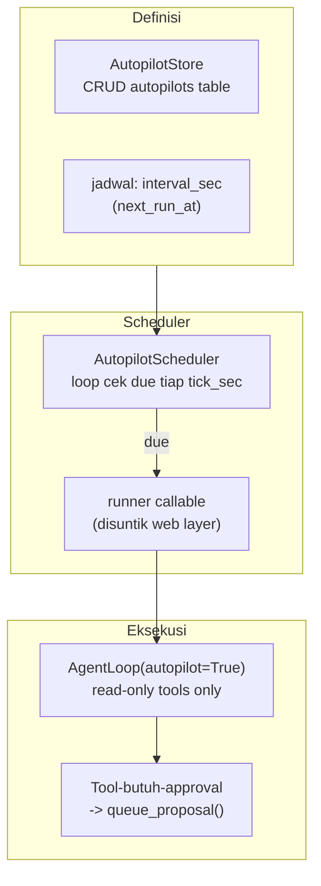
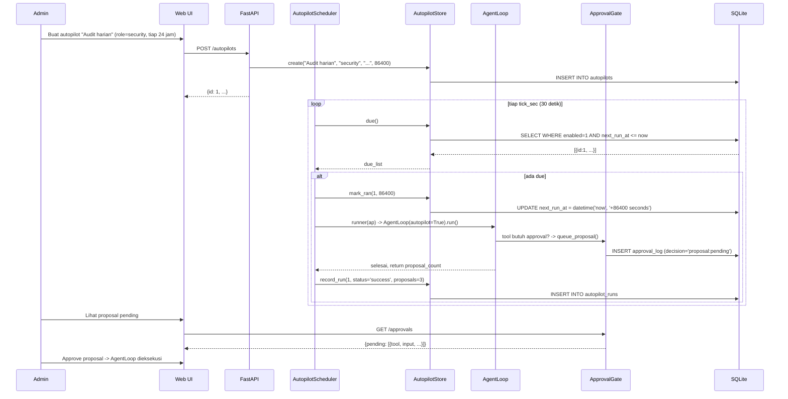

# Flow 7: Autopilot & Calibration — Tugas Terjadwal & Self-Tuning

> **Cerita:** OpenCLAWN bisa menjalankan tugas agent secara otomatis (autopilot) tanpa user
> di depan layar — misalnya audit harian atau ringkasan mingguan. Selain itu, router bisa
> menyetel diri sendiri berdasarkan data audit (auto-calibrate). Keduanya adalah background
> process yang berjalan di loop asyncio.

---

## Autopilot — Agent Berjalan Otomatis

### Konsep

Autopilot = tugas agent yang dijadwalkan berulang. Terinspirasi dari "Autopilots" Multica.

**Keamanan (CLAUDE.md §1, §17):** Autopilot berjalan TANPA manusia. Tool yang butuh approval
TIDAK dieksekusi — diantri sebagai **proposal** (tabel `approval_log`) untuk ditinjau user nanti.

### Struktur



### AutopilotStore — CRUD Tugas

**File:** `core/autopilot.py` -> `AutopilotStore`

**Tabel:**
```sql
CREATE TABLE autopilots (
    id INTEGER PRIMARY KEY,
    name TEXT NOT NULL,
    role TEXT NOT NULL,
    prompt TEXT NOT NULL,
    interval_sec INTEGER NOT NULL,
    enabled INTEGER DEFAULT 1,
    last_run_at TIMESTAMP,
    next_run_at TIMESTAMP,
    created_at TIMESTAMP DEFAULT CURRENT_TIMESTAMP
);
CREATE TABLE autopilot_runs (
    id INTEGER PRIMARY KEY,
    autopilot_id INTEGER REFERENCES autopilots(id),
    status TEXT,          -- running | success | error
    tokens_in INTEGER, tokens_out INTEGER, cost_usd REAL,
    proposals INTEGER,    -- jumlah proposal yang dihasilkan (tool butuh approval)
    error_message TEXT,
    started_at TIMESTAMP, finished_at TIMESTAMP
);
```

**Metode utama:**
```python
class AutopilotStore:
    async def create(self, name, role, prompt, interval_sec) -> dict
    async def list_all(self) -> list[dict]
    async def get(self, id) -> dict | None
    async def set_enabled(self, id, enabled) -> None
    async def delete(self, id) -> None
    async def due(self, now=None) -> list[dict]  # enabled & next_run_at <= now
    async def mark_ran(self, id, interval_sec) -> None  # reschedule next_run_at
    async def record_run(self, autopilot_id, status, **kwargs) -> None
    async def recent_runs(self, limit=20) -> list[dict]
```

Interval di-floor ke `MIN_INTERVAL_SEC = 60` (tidak bisa lebih cepat dari 1 menit).

### AutopilotScheduler — Loop Eksekusi

```python
class AutopilotScheduler:
    def __init__(self, store, runner, config, tick_sec=30):
        self.store = store
        self.runner = runner  # callable: dict -> int (jumlah proposal)
        self.tick_sec = tick_sec

    def start(self):
        self._task = asyncio.create_task(self._loop())

    async def stop(self):
        self._task.cancel()

    async def _loop(self):
        while True:
            await asyncio.sleep(self.tick_sec)
            await self.run_due_once()

    async def run_due_once(self) -> int:
        """Cari tugas yang due, jalankan via runner. Return jumlah yg dijalankan."""
        due_list = await self.store.due()
        for ap in due_list:
            await self.store.mark_ran(ap["id"], ap["interval_sec"])  # reschedule SEBELUM run
            started = datetime.utcnow()
            try:
                proposals = await self.runner(ap)
                status = "success"
            except Exception as e:
                status = "error"
                proposals = 0
            await self.store.record_run(
                ap["id"], status=status, proposals=proposals,
                error_message=str(e) if status == "error" else None,
            )
        return len(due_list)
```

**`mark_ran` dipanggil SEBELUM eksekusi** untuk mencegah double-execution jika dua tick tumpang tindih.

### Runner — Jembatan ke AgentLoop

**File:** `web/main.py` -> `_run_autopilot()`

```python
async def _run_autopilot(ap: dict) -> int:
    session_id = f"autopilot-{ap['id']}"

    async def _count_proposals():
        row = await db.fetchone(
            "SELECT COUNT(*) AS n FROM approval_log WHERE session_id=? AND decision='proposal:pending'",
            (session_id,),
        )
        return (row or {}).get("n", 0)

    before = await _count_proposals()
    agent = AgentLoop(
        AgentConfig(role=ap["role"], session_id=session_id, autopilot=True),
        db=db, approval=approval_gate, question_gate=question_gate,
    )
    async for _ev in agent.run(ap["prompt"]):
        pass  # drain stream — output tidak ke mana-mana
    after = await _count_proposals()
    return max(0, after - before)
```

**Perbedaan dengan AgentLoop normal:**
- `autopilot=True` -> tool butuh-approval jadi `queue_proposal()`, bukan dieksekusi
- Session ID prefixed `autopilot-` untuk membedakan di log
- Stream di-drain tanpa dikirim ke UI

### Flow Lengkap Autopilot



---

## Auto-Calibrate (I4) — Router Menyetel Diri

**File:** `core/calibration.py` -> `CalibrationStore.maybe_auto_apply()`

Loop tertutup Inovasi 1: audit -> rekomendasi -> apply. Fitur **opt-in** (default OFF).

```python
async def maybe_auto_apply(self, config, calibrator=None) -> dict:
    if not config.calibration_auto_apply:
        return {"applied": False, "reason": "auto_apply_disabled"}

    # Throttle
    last = await self.db.fetchone(
        "SELECT created_at FROM calibration_log WHERE source='auto' ORDER BY id DESC LIMIT 1"
    )
    if last:
        elapsed = (datetime.now() - datetime.fromisoformat(last["created_at"])).total_seconds()
        if elapsed < config.calibration_auto_interval_sec:
            return {"applied": False, "reason": "throttled"}

    # Butuh data cukup
    if not calibrator:
        calibrator = RoutingCalibrator()
    report = await RoutingAuditor(self.db).calibration_report()
    recs = calibrator.analyze(report)
    if not recs:
        return {"applied": False, "reason": "no_recommendations"}

    # Ambil rekomendasi top-1, delta dijepit ±1
    delta = max(-config.calibration_auto_max_step,
                min(config.calibration_auto_max_step, recs[0].offset_delta))
    if delta == 0:
        return {"applied": False, "reason": "delta_zero"}
    return await self.apply(delta, recs[0].suggestion, source="auto")
```

**Syarat:**
- `config.calibration_auto_apply = True` (default False)
- Throttle >= `calibration_auto_interval_sec`
- Data cukup (sample >= `calibration_auto_min_sample`)
- Ada rekomendasi
- Delta != 0

---

## Skill Curator — Konsolidasi Skill Mirip (I1)

**File:** `memory/curator.py` -> `SkillCuratorManager`

Throttled post-turn (1x/hari). Mencari skill yang mirip dan menggabungkannya.

```python
async def maybe_run_curation_pass(self):
    # throttle check
    # Cari skill dengan trigger_pattern mirip
    # Jika ditemukan: merge (status='merged', merged_into=new_id)
    # Hanya skill 'active' yang di-curate
```

---

## TL;DR

> **Autopilot:** User buat tugas terjadwal (nama, role, prompt, interval) -> AutopilotStore
> simpan ke DB -> AutopilotScheduler loop cek due tiap 30 detik -> jika due, jalankan
> AgentLoop(autopilot=True) -> tool butuh-approval jadi PROPOSAL (tidak dieksekusi) ->
> catat run ke autopilot_runs. User bisa tinjau proposal pending via /approvals.
>
> **Auto-Calibrate (I4, opt-in):** Post-turn -> cek config (default OFF) -> throttle ->
> calibration_report() -> analyze() -> apply(delta) -> simpan offset baru. Sama seperti
> manual tapi otomatis dan dijepit ±1.
