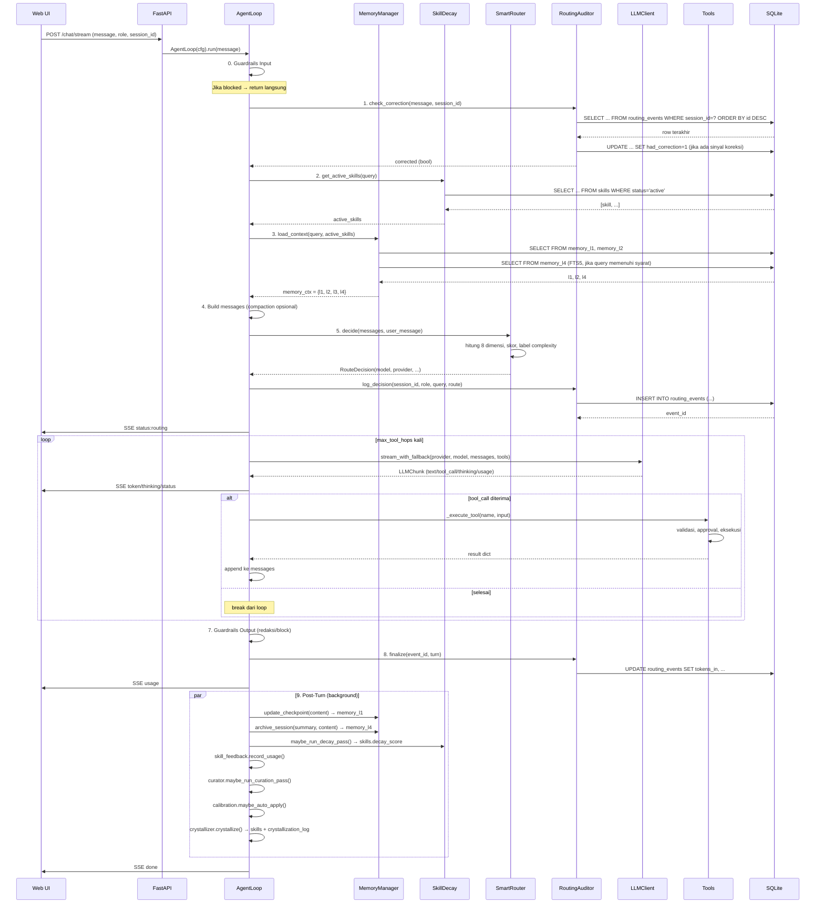

# Flow 1: Chat Single-Agent

> **Cerita:** User mengetik pesan di Web UI → pesan diproses melalui pipeline 9 langkah →
> response di-stream real-time via SSE. Satu turn chat melewati shield → routing → LLM →
> tool loop → memory → crystallizer (post-turn).

---

## Ringkasan Pipeline

```
User Message
    │
    ▼
┌────────────────────────────────────────────────────────────────────┐
│  0. Guardrails (INPUT)          — cek toksisitas/PII sebelum masuk │
│  1. Correction Check            — apakah turn SEBELUMNYA dikoreksi?│
│  2. Load Active Skills          — ambil skill dari DB (L3)         │
│  3. Load Memory Context         — L1/L2/L3/L4                      │
│  4. Build Messages + Compaction — rakit context dengan budget token│
│  5. Route + Log Decision        — pilih model, catat ke audit      │
│  6. Tool Loop (iteratif)        — LLM ↔ tool eksekusi              │
│  7. Guardrails (OUTPUT)         — redaksi PII sebelum simpan       │
│  8. Finalize + Usage            — update audit, yield usage event  │
│  9. Post-Turn (background)      — memory, decay, crystallize       │
└────────────────────────────────────────────────────────────────────┘
    │
    ▼
SSE Stream ke Frontend (token/thinking/status/usage/done)
```

---

## Langkah Detail

### ⚡ 0. Entry Point: HTTP → FastAPI → AgentLoop

**File:** `web/main.py` → `POST /chat/stream`

```
Browser → POST /chat/stream (form: message, role, session_id)
  → main.chat_stream()
      → buat AgentConfig(role, session_id)
      → buat AgentLoop(cfg, db, approval_gate, question_gate)
      → panggil agent.run(message)
      → bungkus dalam StreamingResponse SSE
```

**Kunci arsitektur:**
- `AgentLoop` dibuat **baru tiap request** (stateless per turn)
- Tapi `ApprovalGate` dan `QuestionGate` adalah **singleton** di level app — Future mereka bertahan lintas request (user approve di endpoint lain)
- Session diikat oleh `session_id` (UUID) yang dikirim/diterima frontend

**Streaming keluar (SSE):**
```
event: status  → {text: "routing", detail: "gemini:gemini-2.5-flash"}
event: status  → {text: "thinking"}
event: token   → "teks jawaban di-stream potongan per potongan..."
event: status  → {text: "tool", detail: "file_read(path=src/main.py)"}
event: status  → {text: "thinking"}
event: token   → "lanjutan jawaban..."
event: usage   → {tokens_in, tokens_out, cost_usd, latency_ms, model, context_tokens, max_context_tokens}
event: done    → [DONE]
```

---

### 🛡️ 0. Guardrails Input (NeMO-style)

**File:** `core/guardrails_config.py` + `security/guardrails.py`

Sebelum apa pun, `GuardrailEngine.check_input(message)` dijalankan.

```python
# agent_loop.py baris ~185
guardrails = GuardrailEngine(enabled=await self.guardrails_config.get_enabled())
in_outcome = guardrails.check_input(user_message)
if in_outcome.blocked:
    yield AgentEvent(type="token", text=in_outcome.block_reason)
    return  # STOP — tidak ada pemrosesan lebih lanjut
```

- Konfigurasi `on/off` per rail disimpan di `app_settings` (tabel DB) — bisa diubah via `/settings` tanpa restart
- Jika diblokir → yield satu `token` berisi pesan penolakan, lalu `return` (hentikan generator)

---

### 🔄 1. Correction Check (Audit Feedback)

**File:** `core/audit.py` → `RoutingAuditor.check_correction()`

```python
# agent_loop.py baris ~190
corrected = await self.auditor.check_correction(user_message, self.cfg.session_id)
```

**Apa yang terjadi:**
1. Cari `routing_events` baris **terakhir** untuk session_id yang sama (turn sebelumnya)
2. Jika user_message mengandung kata dalam `CORRECTION_SIGNALS` (seperti "bukan", "salah", "wrong", "fix", dll) → set `had_correction=1` di record itu
3. Return `True`/`False`

**Kenapa penting (Inovasi 1):** Ini adalah sinyal feedback — router tahu apakah keputusannya ternyata salah. Data ini dipakai `calibration_report()` untuk merekomendasikan perubahan threshold.

**Lanjutan: SkillFeedback.resolve_previous()**

```python
# agent_loop.py baris ~196
await self.skill_feedback.resolve_previous(
    self.cfg.session_id, corrected, correction_trace=user_message if corrected else ""
)
```

Jika turn sebelumnya pakai skill & turn ini dikoreksi → skill itu dianggap menyesatkan → `record_draft_outcome(success=False)` (reset counter) atau `refine_on_correction` (perbaiki konten skill).

---

### 📦 2. Load Active Skills (L3)

**File:** `memory/skill_decay.py` → `SkillDecayManager.get_active_skills()`

```python
# agent_loop.py baris ~201
active_skills = await self.decay.get_active_skills(query=user_message)
```

**Query SQL:**
```sql
-- Ambil skill active yang trigger pattern-nya cocok, urut decay_score
SELECT id, skill_name, skill_content, trigger_pattern, decay_score, status
FROM skills
WHERE role=? AND status='active'
  AND (trigger_pattern IS NULL OR ? LIKE '%' || trigger_pattern || '%')
ORDER BY decay_score DESC, use_count DESC LIMIT ?

-- PLUS 1 slot trial untuk draft yang trigger-nya cocok
SELECT ...
FROM skills
WHERE role=? AND status='draft'
  AND trigger_pattern IS NOT NULL AND ? LIKE '%' || trigger_pattern || '%'
ORDER BY draft_success_count DESC, id DESC LIMIT 1
```

**Alur data:**
- Skill yang decay_score-nya tinggi = sering dipakai → prioritas
- Draft skill dapat **1 slot percobaan** (tidak menggusur active) — satu-satunya cara draft naik kelas
- Hasilnya disimpan dalam list `dict`, nanti masuk ke `memory_ctx["l3"]`

---

### 🧠 3. Load Memory Context (L1/L2/L3/L4)

**File:** `memory/layers.py` → `MemoryManager.load_context()`

```python
# agent_loop.py baris ~204
memory_ctx = await self.memory.load_context(user_message, active_skills)
```

**Yang terjadi di dalam:**

| Layer | Tabel | Isi | Limit |
|---|---|---|---|
| **L1** | `memory_l1` | Key-value checkpoint (state terakhir, last_summary) | 20 baris |
| **L2** | `memory_l2` | Fakta penting lintas sesi, urut importance | 30 baris |
| **L3** | *(dari parameter)* | Skill aktif (hasil langkah 2) | `max_active_skills` |
| **L4** | `memory_l4` (FTS5) | Arsip sesi lama — **hanya jika query > 3 kata ATAU mengandung istilah teknis** | 3 arsip |

**L4 FTS5 — syarat ketat:**
```python
if match and (len(query.split()) > 3 or self._has_specific_term(query)):
    # Hanya query bermakna yang trigger FTS5
```

Ini sengaja: FTS5 mahal, hanya diaktifkan saat benar-benar butuh konteks lintas sesi. Kata teknis spesifik ada di `SPECIFIC_TERMS = ["bug", "error", "oauth", "api", "deploy", "fix", "crash"]`.

---

### 📝 4. Build Messages + Compaction (Opsional)

**File:** `core/compactor.py` → `ContextCompactor`

**Sub-langkah 4a: Compaction headroom (opt-in)**
```python
# agent_loop.py baris ~213
history_for_build = await self._maybe_compact(memory_ctx, user_message)
```

- Mode `off` (default) → history apa adanya, `build()` akan truncation biasa
- Mode `local`/`cloud` → panggil LLM summarizer untuk ringkas turn lama jadi 1 blok `[compacted] ...`
- **Fail-safe:** summarizer error → fallback ke history asli

**Sub-langkah 4b: Build messages**
```python
messages = self.compactor.build(
    soul=self._soul["system_prompt"]["content"],
    memory=memory_ctx,
    history=history_for_build,
    user_message=user_message,
)
```

Urutan `messages` yang dikirim ke LLM:
```python
messages = [
    {"role": "system", "content": f"{soul_prompt}\n\n## State\n(L1 items)\n## Facts\n(L2 items)\n## Active Skills\n(L3 items)\n## Past Sessions\n(L4 items)"},
    # history turns (dari terbaru, potong jika token habis, maks 20)
    {"role": "user", "content": "..."},
    {"role": "assistant", "content": "..."},
    ...
    # user message baru
    {"role": "user", "content": user_message},
]
```

**Token budget:**
- Estimasi via `len(text) // 4` (tanpa tiktoken)
- Meter `context_tokens` vs `max_context_tokens` di-emit sebagai `usage` event — frontend render bar yang menguning/memerah saat mendekati batas

---

### 🧭 5. Route + Log Decision (Inovasi 1)

**File:** `core/router.py` → `SmartRouter.decide()`

```python
# agent_loop.py baris ~219
self.router.threshold_offset = await self.calibration.get_offset()
self.router.model_map = await self.router_config.get_map()
route = self.router.decide(messages, user_message)
```

**Proses routing — detil di `routing-audit.md`. Yang penting di sini:**

1. Hitung 8 dimensi dari query (lihat `routing-audit.md`)
2. Soul `upgrade_keywords` cocok? → +3 skor, bypass prefer_local
3. Skor → label Complexity → pilih model dari `model_map`
4. Cek **model override** dari `/settings` — jika user paksa model tertentu, route tetap dicatat asli di `reason`

**Log ke DB:**
```python
event_id = await self.auditor.log_decision(
    self.cfg.session_id, self.cfg.role, user_message, route
)
# INSERT INTO routing_events (session_id, role, query_text, dim_*, complexity_*, model_chosen, ...)
```

**Yield status ke UI:**
```python
yield AgentEvent(type="status", text="routing", detail=f"{route.provider}:{route.model}")
```

---

### 🔧 6. Tool Loop (Iteratif, Bukan Rekursif)

**File:** `core/agent_loop.py` → `_run_tool_loop()` + `_execute_tool()`

**Flow:**
```
LLM stream (dengan tools_schema)
    → jika LLM return text biasa → yield token → break (selesai)
    → jika LLM return tool_call → simpan pending_tool
        → deteksi loop (tool+input sama ≥3× berturut-turut?)
            → ya: hard break, yield loop_stopped
        → eksekusi tool (lihat tool-execution.md)
        → append result ke messages sebagai {"role": "tool", ...}
        → lanjut ke hop berikutnya (maks max_tool_hops)
```

**Detil eksekusi tool — `_execute_tool()`:**
1. Cek `TOOL_REGISTRY[name]` ada?
2. Cek `_tool_allowed(name)` — soul.toml izinkan?
3. Validasi input vs schema (`_validate_tool_input`)
4. Tool internal? (`todo_write`, `report_blocker`) → suntik `_session_id`, `_role`
5. Butuh approval? → `ApprovalGate.request()` (tunggu user approve/reject)
6. **Eksekusi via** `asyncio.wait_for(timeout=tool_timeout_sec)`
7. **Truncate output** — potong field teks > `tool_max_output` karakter
8. **Catat telemetri** → `ToolAudit.record()` → INSERT `tool_invocations`

**Detil stream LLM:**
```python
async for chunk in self.llm.stream_with_fallback(provider, model, messages, tools_schema):
    if chunk.type == "text":        # yield token ke frontend
    elif chunk.type == "thinking":  # yield thinking (collapsible di UI)
    elif chunk.type == "tool_call": # simpan, nanti dieksekusi
    elif chunk.type == "usage":     # update turn.tokens_in/out
    elif chunk.type == "fallback":  # yield status fallback
```

**Lihat `tool-execution.md` untuk detil lengkap.**

---

### 🚧 7. Guardrails Output (NeMO-style)

**File:** `security/guardrails.py` → `GuardrailEngine.run(RailStage.OUTPUT, ...)`

```python
out_outcome = guardrails.run(RailStage.OUTPUT, turn.content)
```

**Catatan penting:**
- Token sudah di-stream ke frontend (SSE real-time) — **tidak bisa ditarik**
- Guardrails output bekerja pada `turn.content` **lengkap** setelah tool loop selesai
- Jika **blocked** → konten diganti pesan penahanan, yield `guardrail` event
- Jika **redacted** → PII diganti `[REDACTED]`, yield `guardrail` event dengan daftar temuan
- Versi yang dimodifikasi **disimpan ke history & memori** (bukan teks asli)

---

### ✅ 8. Finalize + Usage Event

```python
# agent_loop.py baris ~255
turn.latency_ms = int((time.monotonic() - start) * 1000)
turn.cost_usd = route.cost_per_1k * (turn.tokens_in + turn.tokens_out) / 1000

self.history.append(Turn(role="user", content=user_message))
self.history.append(turn)

await self.auditor.finalize(event_id, turn)
# UPDATE routing_events SET tokens_in, tokens_out, cost_usd, latency_ms WHERE id=?
```

**Yield usage event ke frontend:**
```python
yield AgentEvent(type="usage", usage={
    "tokens_in": ...,
    "tokens_out": ...,
    "cost_usd": ...,
    "latency_ms": ...,
    "model": ...,
    "context_tokens": ...,          # meter budget
    "max_context_tokens": ...,      # batas
})
```

---

### 🔄 9. Post-Turn (Background Tasks)

**File:** `core/agent_loop.py` → `_post_turn()`

Dijalankan sebagai `asyncio.create_task()` — **tidak memblokir SSE stream**. Error ditangkap via `add_done_callback`.

```python
async def _post_turn(self, user_message, turn, active_skills, history_snapshot):
```

**Urutan eksekusi post-turn:**

| # | Aksi | Fungsi | Tabel DB | Syarat |
|---|---|---|---|---|
| 1 | **L1 Checkpoint** | `memory.update_checkpoint(turn.content)` | `memory_l1` (UPSERT) | Turn punya konten |
| 2 | **L4 Archive** | `memory.archive_session(summary, full_content)` | `memory_l4` (DELETE+INSERT) | History ≥ `archive_after_turns` turn |
| 3 | **Decay Pass** | `decay.maybe_run_decay_pass()` | `skills` (UPDATE decay_score) | Throttled 1 jam |
| 4 | **SkillFeedback** | `skill_feedback.record_usage(session_id, used_ids)` | — (dalam memori, dipakai turn depan) | Ada skill yang dipakai |
| 5 | **Curator Pass** | `curator.maybe_run_curation_pass()` | `skills` (merge) | Throttled 1×/hari |
| 6 | **Auto-Calibrate** | `calibration.maybe_auto_apply(config)` | `calibration_log`, `app_settings` | Opt-in, throttled |
| 7 | **User Model** | `user_model.maybe_update()` | — (I5, opsional) | Default nonaktif |
| 8 | **Crystallize** | `crystallizer.crystallize(...)` | `skills`, `crystallization_log` | ≥3 tool calls |

**Crystallize syarat:** Total tool call di history ≥ `MIN_TOOL_CALLS` (3).

---

## Diagram Urutan (Sequence)



---

## Ringkasan Tabel yang Disentuh per Turn

| Tabel | Operasi | Kapan |
|---|---|---|
| `routing_events` | INSERT (log_decision) + UPDATE (finalize) + UPDATE (check_correction) | Langkah 1, 5, 8 |
| `memory_l1` | UPSERT (checkpoint) | Post-turn step 1 |
| `memory_l4` | DELETE + INSERT (archive) | Post-turn step 2 (jika cukup panjang) |
| `skills` | UPDATE decay_score | Post-turn step 3 (throttled) |
| `skills` | INSERT (crystallize) | Post-turn step 8 (jika ≥3 tool calls) |
| `crystallization_log` | INSERT (crystallize attempt) | Post-turn step 8 |
| `tool_invocations` | INSERT (tiap tool call) | Langkah 6 (tiap eksekusi tool) |
| `approval_log` | INSERT (jika tool butuh approval) | Langkah 6 (ApprovalGate) |

---

## TL;DR untuk Flow Chat

> User kirim pesan → Guardrails cek → Koreksi turn sebelumnya dideteksi → Skill aktif dimuat → Memory L1/L2/L4 dibaca → Context dirakit (dengan atau tanpa compaction) → Router pilih model berdasarkan 8 dimensi + soul.toml → Catat ke audit DB → LLM dipanggil → Stream token ke UI → Jika LLM minta tool, eksekusi (dengan approval jika perlu) → Loop sampai selesai → Guardrails output periksa → Finalize audit → **Background post-turn**: simpen checkpoint, arsip, decay skill, crystallize kalau ≥3 tool calls.
