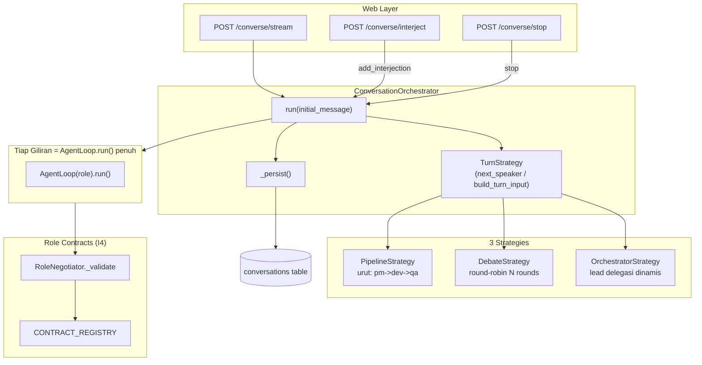
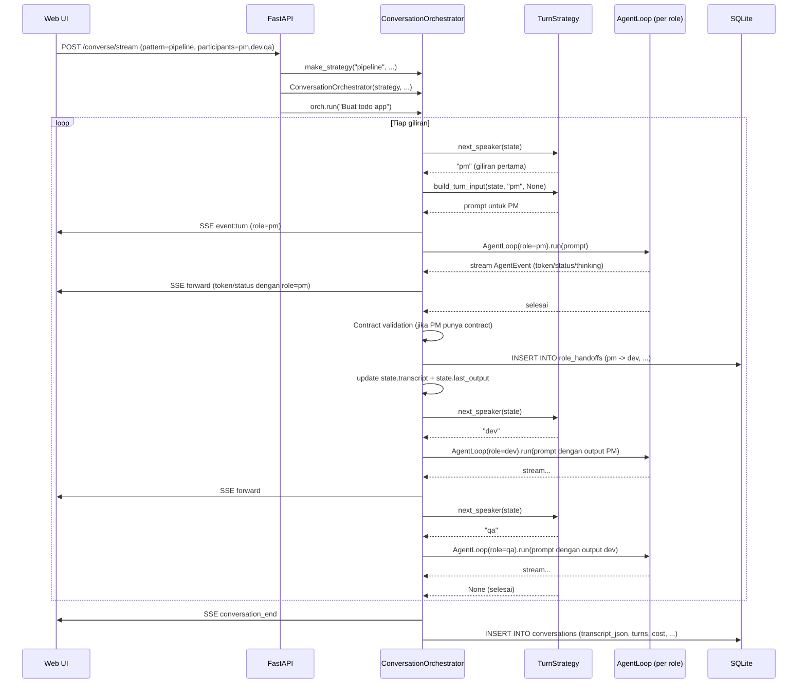

# Flow 6: Multi-Agent Conversation — Beberapa Role Saling Mengobrol

> **Cerita:** User ingin beberapa role AI (mis. PM -> Dev -> QA) bekerja sama dalam satu
> percakapan. Setiap giliran adalah `AgentLoop.run()` penuh — dengan routing, tool, memory,
> crystallizer sendiri-sendiri. Tiga pola percakapan: pipeline (urutan tetap), debate
> (round-robin), orchestrator (lead delegasi dinamis). Inovasi 4: output tiap role divalidasi
> vs Pydantic contract.

---

## Ringkasan Arsitektur



---

## Entry Point

**File:** `web/main.py` -> `POST /converse/stream`

```python
form data: message, pattern (pipeline|debate|orchestrator),
           session_id, rounds, participants (comma-separated)
```

```python
strategy = make_strategy(pattern, participants, rounds, CONFIG)
control = ConversationControl(disconnect_check=request.is_disconnected)
_conversations[session_id] = control

def agent_factory(role: str) -> AgentLoop:
    return AgentLoop(
        AgentConfig(role=role, session_id=session_id),
        db=db, approval=approval_gate, question_gate=question_gate,
    )

orch = ConversationOrchestrator(
    strategy=strategy, db=db, agent_factory=agent_factory,
    session_id=session_id, config=CONFIG, control=control, pattern=pattern,
)

# Stream events via SSE
async for ev in orch.run(message):
    # ev.type: "turn" | "token" | "thinking" | "status" | "conversation_end"
    yield f"event: {ev.type}\ndata: {json.dumps(...)}\n\n"
```

**Session management:**
- `_conversations` dict global menyimpan `ConversationControl` per session
- `/converse/interject` -> `control.add_interjection(text)` — disuntik ke giliran berikutnya
- `/converse/stop` -> `control.stop()` — STOP di cek tiap giliran
- STOP utama via `AbortController` frontend + `request.is_disconnected`

---

## Tiga Pola Percakapan

### 1. PipelineStrategy — Handoff Berurutan

```
User: "Buat aplikasi todo"
  -> [PM] mem-breakdown requirements -> output: PRD document
  -> [Dev] implement based on PRD -> output: code
  -> [QA] review & test -> output: test report
```

**Terminasi:** Setelah participant terakhir selesai.

**Build turn input:** Suapkan output role sebelumnya (tervalidasi jika ada contract).
```python
def build_turn_input(self, state, role, interjection):
    parts = [f"Anda adalah role '{role}' dalam pipeline {'->'.join(self.participants)}."]
    user_goal = next((c for r, c in state.transcript if r == "user"), "")
    if user_goal:
        parts.append(f"Tujuan user: {user_goal}")
    if state.last_output:
        parts.append(f"Output role sebelumnya:\n{json.dumps(state.last_output)}")
    if interjection:
        parts.append(f"[USER menyela]: {interjection}")
    return "\n\n".join(parts)
```

**`wants_contract(role)` -> True** jika role ada di `CONTRACT_REGISTRY`.

---

### 2. DebateStrategy — Round-Robin Bebas

```
User: "Apakah kita pakai REST atau GraphQL?"
  -> Round 1: [PM] argue from product perspective
  -> Round 1: [Dev] argue from technical perspective
  -> Round 1: [QA] argue from testing perspective
  -> Round 2: [PM] rebuttal...
  -> Berhenti setelah rounds * N giliran
```

**Build turn input:** Seluruh transkrip + sudut pandang role.
```python
def build_turn_input(self, state, role, interjection):
    transcript = "\n".join(f"[{r.upper()}]: {c}" for r, c in state.transcript)
    parts = [
        f"Diskusi multi-peran. Anda role '{role}'.",
        f"Diskusi sejauh ini:\n{transcript}",
    ]
    if interjection:
        parts.append(f"[USER menyela]: {interjection}")
    return "\n\n".join(parts)
```

**Tidak pakai contract** — debat bebas, teks mentah.

---

### 3. OrchestratorStrategy — Lead Delegasi Dinamis

```
User: "Audit keamanan codebase kita"
  -> [Lead/Security] pahami permintaan
  -> [Lead] decide: delegate ke [Dev] untuk cek dependensi
     Directive: {"delegate_to": "dev", "task": "Cek vulnerabilities di package.json"}
  -> [Dev] eksekusi
  -> [Lead] sintesis hasil
  -> [Lead] decide: delegate ke [QA] untuk cek config
     Directive: {"delegate_to": "qa", "task": "Review Dockerfile security"}
  -> [QA] eksekusi
  -> [Lead] sintesis final
  -> [Lead] decide: {"done": true} -> selesai
```

**Parsing directive dari output lead:**
```python
try:
    directive = json.loads(lead_output)
    if "delegate_to" in directive:
        return directive["delegate_to"]  # giliran worker
    elif "done" in directive:
        return None  # selesai
except (json.JSONDecodeError, ValueError):
    # Fallback: lead -> semua worker -> lead -> selesai
    self._fallback = True
```

**Fallback aman:** Jika lead output tidak terparse sebagai JSON -> alur tetap (lead -> worker1 -> worker2 -> ... -> lead sintesis -> selesai).

---

## ConversationOrchestrator.run() — Loop Utama

**File:** `core/conversation.py` -> `ConversationOrchestrator.run()`

```python
async def run(self, initial_message) -> AsyncGenerator[ConversationEvent, None]:
    state = ConversationState(
        transcript=[("user", initial_message)],
        turn_index=0,
    )
    totals = {"tokens_in": 0, "tokens_out": 0, "cost_usd": 0.0, "turns": 0}

    while state.turn_index <= self.config.max_conversation_turns:
        # 1. Cek STOP
        if await self.control.is_stopped():
            end_reason = "stopped"
            break

        # 2. Siapa bicara berikutnya?
        role = self.strategy.next_speaker(state)
        if role is None:
            end_reason = "strategy_done"
            break

        # 3. Rakit input + interjection
        interjection = self.control.pop_interjection()
        turn_input = self.strategy.build_turn_input(state, role, interjection)
        if interjection:
            state.transcript.append(("user", f"[INTERJECT] {interjection}"))

        # 4. Emit "turn" -> UI buka bubble baru
        yield ConversationEvent(type="turn", role=role, text=f"{role} (turn {state.turn_index})")

        # 5. Jalankan AgentLoop untuk role ini
        agent = self.agent_factory(role)
        async for event in agent.run(turn_input):
            if event.type in ("token", "thinking"):
                yield ConversationEvent(type=event.type, role=role, text=event.text)
            elif event.type == "status":
                yield ConversationEvent(type="status", role=role, text=event.text, detail=event.detail)
            elif event.type == "usage" and event.usage:
                # Akumulasi total cost lintas giliran
                for k in ("tokens_in", "tokens_out", "cost_usd"):
                    totals[k] = totals.get(k, 0) + event.usage.get(k, 0)

        # 6. Validasi output (Inovasi 4) jika strategy wants_contract
        state.last_output = {"text": agent.history[-1].content if agent.history else ""}
        if self.strategy.wants_contract(role) and role in CONTRACT_REGISTRY:
            validated = parse_contract(role, state.last_output["text"])
            if validated:
                state.last_output = validated.model_dump()
                # Catat ke role_handoffs
                await self.db.execute(
                    """INSERT INTO role_handoffs (session_id, from_role, to_role,
                       task_input, contract_name, output_json, validation_ok)
                       VALUES (?,?,?,?,?,?,?)""",
                    (self.session_id, role, "...", turn_input[:200],
                     type(validated).__name__, json.dumps(state.last_output), 1),
                )

        # 7. Update state
        state.transcript.append((role, state.last_output.get("text", "")))
        state.turn_index += 1

    # Akhir percakapan
    yield ConversationEvent(type="conversation_end", detail=end_reason, usage=totals)
    await self._persist(initial_message, state, end_reason, totals)
```

---

## Role Contracts (Inovasi 4)

**File:** `roles/contracts.py` -> `CONTRACT_REGISTRY`

Setiap role bisa punya Pydantic contract untuk outputnya:

```python
class PRDSpec(BaseModel):
    overview: str
    requirements: list[str]
    priorities: dict[str, str]
    acceptance_criteria: list[str]

class CodeOutput(BaseModel):
    files: list[dict]  # [{"path": "...", "content": "..."}]
    dependencies: list[str]
    test_strategy: str

class QAReport(BaseModel):
    issues: list[dict]
    severity_counts: dict[str, int]
    recommendation: str

CONTRACT_REGISTRY = {
    "pm": PRDSpec,
    "dev": CodeOutput,
    "qa": QAReport,
}
```

**Validasi:**
```python
def parse_contract(role: str, text: str) -> BaseModel | None:
    contract = CONTRACT_REGISTRY.get(role)
    if not contract:
        return None
    try:
        parsed = parse_json_from_text(text)  # cari JSON dalam teks
        return contract(**parsed)
    except (json.JSONDecodeError, ValidationError):
        return None  # degrade graceful — lanjut dengan teks mentah
```

Jika validasi gagal -> `validation_ok = 0`, output tetap diproses sebagai teks mentah. Tidak pernah crash turn.

---

## Diagram Lengkap Multi-Agent Flow



---

## State vs Control

| Konsep | Kelas | Isi | Dimodifikasi oleh |
|---|---|---|---|
| **State** | `ConversationState` | transcript, last_output, turn_index, round_index | Orchestrator (setelah tiap giliran) |
| **Control** | `ConversationControl` | _stopped, _interjections | User via /stop, /interject |

Pemisahan ini sengaja: state adalah **data** yang dibaca strategy untuk mengambil keputusan; control adalah **sinyal** dari luar (user) yang memengaruhi loop.

---

## Tabel yang Disentuh

| Tabel | Operasi | Kapan |
|---|---|---|
| `conversations` | INSERT | Akhir percakapan (`_persist`) |
| `role_handoffs` | INSERT | Tiap giliran yang punya contract |


## TL;DR untuk Conversation Flow

> User kirim pesan + pilih pola (pipeline/debate/orchestrator) -> ConversationOrchestrator
> loop: tanya strategy siapa bicara berikutnya -> rakit prompt + interjection -> jalankan
> AgentLoop(role).run() penuh (dengan routing, tool, memory sendiri) -> validasi output vs
> Pydantic contract -> catat ke role_handoffs -> lanjut ke giliran berikutnya -> selesai
> -> simpan transkrip ke conversations table. User bisa STOP kapan saja atau INTERJECT
> (menyela) yang disuntik ke giliran berikutnya.
