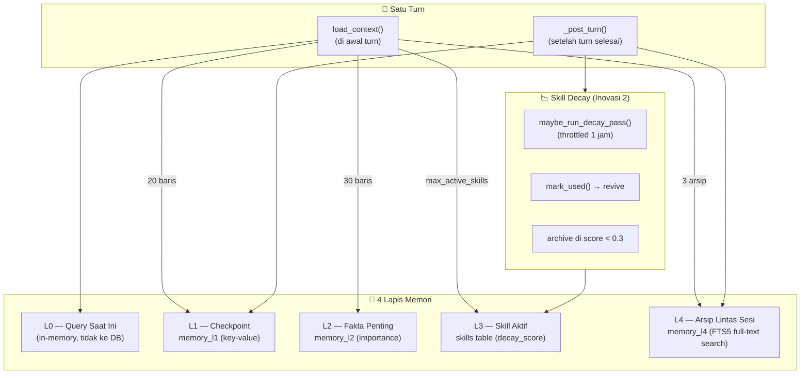
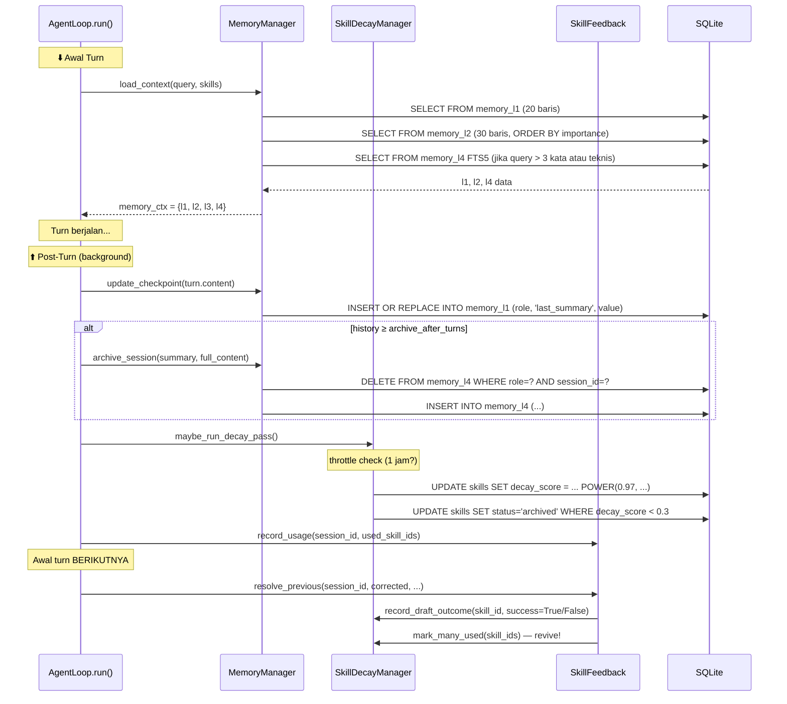

# Flow 3: Memory — L0–L4 & Skill Decay

> **Cerita:** Agent perlu mengingat apa yang terjadi sebelumnya — di turn ini, di sesi ini,
> dan di sesi-sesi lalu. OpenCLAWN punya 4 lapis memori (L1–L4) plus skill decay (Inovasi 2)
> yang memastikan skill jarang pakai memudar. Semua ini dibaca di awal turn (load_context)
> dan ditulis di post-turn.

---

## Arsitektur Memory



---

## L0 — Query Saat Ini (In-Memory)

**Tidak ada tabel.** Hanya variabel `self.history: list[Turn]` di `AgentLoop`.

Setiap turn menambah 2 Turn:
```python
self.history.append(Turn(role="user", content=user_message))
self.history.append(Turn(role="assistant", content=turn.content, tool_calls=..., ...))
```

**Digunakan oleh:**
- `ContextCompactor.build()` — untuk menyusun context message ke LLM
- `should_attempt()` — menghitung tool calls
- `_render_history()` — serialisasi ke teks untuk arsip L4

**Masa hidup:** Satu request web. `AgentLoop` dibuat baru tiap `POST /chat/stream`.

---

## L1 — Checkpoint (Tiap Turn)

**File:** `memory/layers.py` → `MemoryManager.update_checkpoint()`

**Tabel:** `memory_l1`
```sql
CREATE TABLE memory_l1 (
    id INTEGER PRIMARY KEY,
    role TEXT NOT NULL,
    key TEXT NOT NULL,
    value TEXT NOT NULL,
    updated_at TIMESTAMP DEFAULT CURRENT_TIMESTAMP,
    UNIQUE(role, key)
);
```

**Ditulis** di post-turn (tiap turn):
```python
async def update_checkpoint(self, summary: str) -> None:
    await self.db.execute(
        """INSERT INTO memory_l1 (role, key, value) VALUES (?, 'last_summary', ?)
           ON CONFLICT(role, key) DO UPDATE SET value=excluded.value,
           updated_at=CURRENT_TIMESTAMP""",
        (self.role, summary[:500]),
    )
```

**Dibaca** di awal turn berikutnya:
```python
l1_rows = await self.db.fetchall(
    "SELECT key, value FROM memory_l1 WHERE role=? LIMIT 20", (self.role,)
)
l1 = {r["key"]: r["value"] for r in l1_rows}
```

**Isi:** Hanya `last_summary` saat ini (isi jawaban agent). UPSERT tiap turn — hanya 1 baris per role.

**Format di context LLM:**
```
## State
last_summary: <isi jawaban turn terakhir>
```

---

## L2 — Fakta Penting (Lintas Sesi)

**File:** `memory/layers.py` → `MemoryManager.add_fact()`

**Tabel:** `memory_l2`
```sql
CREATE TABLE memory_l2 (
    id INTEGER PRIMARY KEY,
    role TEXT NOT NULL,
    fact TEXT NOT NULL,
    importance INTEGER DEFAULT 1,
    locale TEXT DEFAULT 'neutral',
    created_at TIMESTAMP DEFAULT CURRENT_TIMESTAMP
);
CREATE INDEX idx_l2_role ON memory_l2(role, importance DESC);
```

**Ditulis** oleh tool atau kode lain yang memanggil `add_fact()`:
```python
await memory.add_fact("User prefers Python over JavaScript", importance=3)
```

**Dibaca** di load_context:
```python
l2_rows = await self.db.fetchall(
    "SELECT fact FROM memory_l2 WHERE role=? ORDER BY importance DESC LIMIT 30",
    (self.role,),
)
```

**Format di context LLM:**
```
## Facts
- User prefers Python over JavaScript (importance: 3)
```

**Catatan:** `add_fact` belum terintegrasi penuh di agent loop — ini area yang bisa dikembangkan. Saat ini facts ditambahkan secara manual atau oleh tool tertentu.

---

## L3 — Skill Aktif (Dengan Decay Score)

Bukan tabel terpisah — menggunakan tabel `skills`.

**File:** `memory/skill_decay.py` → `SkillDecayManager.get_active_skills()`

**Dibaca** di awal turn (lihat `chat-flow.md` langkah 2).

**Format di context LLM:**
```
## Active Skills
- [skill_name] (confidence: X.X, trigger: pattern)
  [skill_content]
```

**Decay score menjawab:** skill mana yang paling relevan? Skill sering pakai → score tinggi → muncul di atas. Skill jarang pakai → score turun → tergeser.

---

## L4 — Arsip Lintas Sesi (FTS5)

**File:** `memory/layers.py` → `MemoryManager.archive_session()`

**Tabel:** `memory_l4` (FTS5)
```sql
CREATE VIRTUAL TABLE memory_l4 USING fts5(
    role, session_id, summary, full_content, created_at UNINDEXED
);
```

**Ditulis** di post-turn jika history ≥ `archive_after_turns`:
```python
async def archive_session(self, summary, full_content):
    # Hapus arsip lama session ini (idempoten)
    await self.db.execute(
        "DELETE FROM memory_l4 WHERE role=? AND session_id=?",
        (self.role, self.session_id),
    )
    # INSERT arsip baru
    await self.db.execute(
        """INSERT INTO memory_l4 (role, session_id, summary, full_content, created_at)
           VALUES (?,?,?,?, datetime('now'))""",
        (self.role, self.session_id, summary, full_content),
    )
```

**Dibaca** hanya jika query memenuhi syarat ketat:
```python
# memory/layers.py
match = fts5_query(query)
if match and (len(query.split()) > 3 or self._has_specific_term(query)):
    l4_rows = await self.db.fetchall(
        """SELECT summary FROM memory_l4
           WHERE role=? AND memory_l4 MATCH ? ORDER BY rank LIMIT 3""",
        (self.role, match),
    )
```

FTS5 query di-preprocess di `memory/search.py` → `fts5_query()`:
- Hapus karakter khusus FTS5
- Validasi agar query aneh (syntax error) tidak crash turn
- Return `None` jika query tidak layak search

**Format di context LLM:**
```
## Past Sessions
- [summary dari arsip 1]
- [summary dari arsip 2]
```

---

## Skill Decay (Inovasi 2)

**File:** `memory/skill_decay.py` → `SkillDecayManager`

### Formula Decay

```python
decay_score = score * (0.97 ^ days_since_last_used)
```

**SQL (via custom function POWER):**
```sql
UPDATE skills
SET decay_score = ROUND(decay_score * POWER(0.97, ?), 4)
WHERE role=? AND status IN ('active', 'draft')
```

`POWER(base, exp)` didaftarkan sebagai custom function SQLite di `DatabaseManager.__init__()` karena SQLite tidak punya bawaan.

### `maybe_run_decay_pass()`

```python
async def maybe_run_decay_pass(self):
    now = time.time()
    if now - self._last_decay_ts < self.config.decay_throttle_sec:
        return  # throttle — default 1 jam
    
    since_days = (now - self._last_decay_ts) / 86400
    # UPDATE decay_score untuk semua skill active/draft
    await self.db.execute(...)
    # Archive skill dengan decay_score < archive_threshold (0.3)
    await self.db.execute(
        "UPDATE skills SET status='archived' WHERE ... AND decay_score < ?",
        (self.config.skill_archive_threshold,),
    )
    self._last_decay_ts = now
```

**Throttle:** Dipanggil tiap post-turn, tapi mayoritas no-op. Hanya berjalan setiap `decay_throttle_sec` (default 3600 = 1 jam).

### `mark_used(skill_id)` — Revive

```python
async def mark_used(self, skill_id):
    await self.db.execute("""
        UPDATE skills
        SET use_count = use_count + 1,
            last_used_at = ?,
            decay_score = MIN(1.0, decay_score + ?),
            status = CASE WHEN status='archived' THEN 'active' ELSE status END
        WHERE id = ?
    """, (datetime.now().isoformat(), self.config.skill_revive_boost, skill_id))
```

- `use_count` +1
- `last_used_at` = sekarang
- `decay_score` naik sebesar `skill_revive_boost` (dibatasi max 1.0)
- Jika status `archived` → balik ke `active` (revive!)

### Threshold

| Parameter | Default | Arti |
|---|---|---|
| `decay_throttle_sec` | 3600 (1 jam) | Frekuensi minimal antar decay pass |
| `skill_archive_threshold` | 0.3 | Decay score di bawah ini → archived |
| `skill_revive_boost` | 0.3 | Kenaikan score saat skill dipakai lagi |
| `draft_promote_uses` | config | Berapa kali draft sukses sebelum promote |

---

## Diagram Alur Memory per Turn



---

## Ringkasan: Kapan Data Masuk ke Tabel?

| Tabel | Frekuensi | Pemicu | Fungsi |
|---|---|---|---|
| `memory_l1` | Setiap turn (UPSERT) | Post-turn | Checkpoint state terakhir |
| `memory_l2` | Jarang (manual/tool) | `add_fact()` dipanggil | Fakta penting lintas sesi |
| `skills` | Per crystallize | Post-turn ≥3 tool calls | Skill baru |
| `skills.decay_score` | Per decay pass (throttled) | Post-turn | Update score eksponensial |
| `skills.status` | Per decay pass / promote | Post-turn | Archive atau promote |
| `memory_l4` | Per archive (jarang) | Post-turn jika history panjang | Full-text search arsip |

---

## TL;DR untuk Memory

> **Awal turn:** load_context() baca L1 (checkpoint terakhir, 20 baris) + L2 (fakta penting, 30 baris, urut importance) + L3 (skill aktif, urut decay_score) + L4 (arsip FTS5, hanya jika query >3 kata atau mengandung istilah teknis). Semua digabung ke system prompt sebagai ## State, ## Facts, ## Active Skills, ## Past Sessions.
>
> **Post-turn:** update_checkpoint() timpa L1 → archive_session() simpan ke L4 jika history cukup panjang → maybe_run_decay_pass() update decay_score semua skill (eksponensial, 0.97^hari, throttle 1 jam) + archive yang score < 0.3 → record_usage() catat skill yang dipakai.
>
> **Skill Decay (I2):** `score = score × (0.97 ^ hari)` — skill yang dipakai lagi → revive (score naik, archived → active). Skill tak terpakai terus memudar sampai archived di 0.3.
