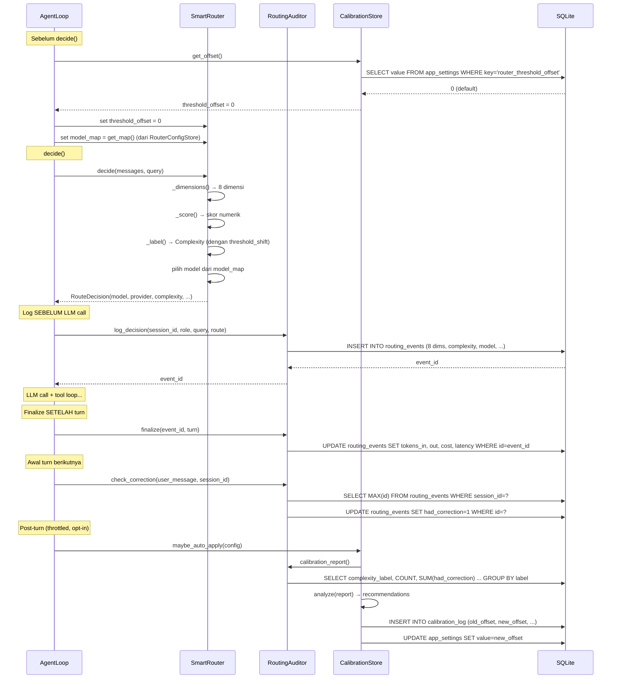

# Flow 4: Routing & Audit — Memilih Model & Merekam Keputusan

> **Cerita:** Sebelum LLM dipanggil, router harus memutuskan model mana yang paling cocok
> untuk query user. Keputusan ini dicatat di tabel `routing_events` (Inovasi 1). Jika ternyata
> keputusan salah (user koreksi), auditor mendeteksinya dan calibration advisor bisa
> merekomendasikan penyesuaian threshold.

---

## Ringkasan Routing

```mermaid
flowchart LR
    subgraph INPUT["Input"]
        Q["Query user"]
        H["History length"]
        R["Role aktif"]
        S["Soul.toml\nupgrade_keywords\nprefer_local"]
    end

    subgraph DIMS["8 Dimensi"]
        T["query_tokens"]
        TK["has_tech_kw"]
        MS["needs_multistep"]
        HL["history_len"]
        RL["role"]
        HU["has_urgency"]
        NS["needs_stream (always 1)"]
        IC["is_continuation"]
    end

    subgraph DECISION["Keputusan"]
        SCORE["Skor numerik"]
        LABEL["Complexity label\n(TRIVIAL→CRITICAL)"]
        MODEL["Model + Provider"]
    end

    INPUT --> DIMS
    DIMS --> SCORE
    SCORE --> LABEL
    LABEL --> MODEL
```



---

## Langkah Detail

### 1. Load Soul + Threshold

**File:** `core/router.py` → `SmartRouter.__init__()`

```python
soul = self._load_soul(role, soul_path)
routing_cfg = soul.get("routing", {})
self.prefer_local = routing_cfg.get("prefer_local", False)
self.soul_upgrade_kw = routing_cfg.get("upgrade_keywords", [])
```

**Soul.toml example:**
```toml
[routing]
prefer_local = true
upgrade_keywords = ["deploy", "infra", "arsitektur", "scalability"]
tech_keywords = ["api", "database", "endpoint"]
multistep_keywords = ["refactor", "migrate", "implement"]
urgency_keywords = ["sekarang", "urgent", "asap", "critical"]
```

**Sebelum decide, AgentLoop menyetel:**
```python
self.router.threshold_offset = await self.calibration.get_offset()  # dari DB
self.router.model_map = await self.router_config.get_map()  # dari DB atau default MODELS
```

---

### 2. Hitung 8 Dimensi

**File:** `core/router.py` → `_dimensions()`

```python
def _dimensions(self, messages, query):
    return {
        "query_tokens": len(query) // 4,      # estimasi token
        "has_tech_kw": int(any(k in q_lower for k in self.tech_kw)),
        "needs_multistep": int(any(k in q_lower for k in self.multi_kw)),
        "history_len": len(messages) - 1,      # -1 karena system prompt
        "role": self.role,
        "has_urgency": int(any(k in q_lower for k in self.urgency_kw)),
        "needs_stream": 1,                     # selalu 1
        "is_continuation": int(len(messages) > 2),  # history > 2 = lanjutan
    }
```

**Dukungan multibahasa (tiga lapis):**

| Lapis | Sinyal | Nama metode | Multibahasa? |
|---|---|---|---|
| 1. Netral-bahasa | `query_tokens`, `history_len`, `is_continuation` | built-in | ✅ Universal |
| 2. Keyword | `has_tech_kw`, `needs_multistep`, `has_urgency` | keyword dari config + soul | ⚠️ Per-bahasa |
| 3. Struktural | `has_code_signal` | `_has_code_signal()` | ✅ Universal |

Lapis 3 (`_has_code_signal`) mendeteksi code fence `` ``` ``, URL, 2+ simbol kode (`{}();=>` dll) — **bekerja di bahasa apa pun** tanpa perlu daftar keyword. +2 skor.

**Language bump (opt-in):** Jika `routing_language_bump=True`, router deteksi script query via Unicode block. Jika script di luar `routing_local_scripts` (default: `("latin",)`) → threshold digeser -1 (naik tier, karena cloud umumnya lebih multibahasa).

---

### 3. Skor → Label → Model

**Skor numerik:**
```python
def _score(self, dimensions):
    score = 0
    score += dimensions["query_tokens"] // 20    # panjang query
    score += dimensions["has_tech_kw"] * 2        # keyword teknis
    score += dimensions["needs_multistep"] * 3    # multi-langkah
    score += dimensions["has_urgency"] * 1         # urgensi
    score += dimensions["history_len"] // 5        # konteks percakapan
    score += dimensions["is_continuation"] * 1     # lanjutan
    score += has_code_signal * 2                   # sinyal kode
    if dimensions["soul_upgrade_hit"]:
        score += 3  # upgrade_keywords dari soul +3
    return score
```

**Label complexity (dengan threshold shift):**
```python
def _label(self, score, threshold_shift):
    # threshold_shift = prefer_local (+1) + threshold_offset (kalibrasi)
    if score < 3 + threshold_shift: return Complexity.TRIVIAL
    if score < 6 + threshold_shift: return Complexity.SIMPLE
    if score < 10 + threshold_shift: return Complexity.MODERATE
    if score < 15 + threshold_shift: return Complexity.COMPLEX
    return Complexity.CRITICAL
```

**Default model map (bisa di-override via /router):**

| Complexity | Model | Provider | Biaya |
|---|---|---|---|
| TRIVIAL | `gemma4:e4b` | Ollama (lokal) | $0 |
| SIMPLE | `deepseek-r1:latest` | Ollama (lokal) | $0 |
| MODERATE | `qwen3.5:9b` | Ollama (lokal) | $0 |
| COMPLEX | `gemini-2.5-flash` | Gemini (cloud) | $0.000XX |
| CRITICAL | `gemini-2.5-pro` | Gemini (cloud) | $0.001XX |

**Model override dari /settings:** Jika user paksa model tertentu:
```python
override = await self.settings.get_model_override()
if override:
    route.reason = f"[override→{ov_provider}:{ov_model}] {route.reason}"
    route.provider = ov_provider
    route.model = ov_model
```
Keputusan router asli tetap tercatat di `reason` untuk transparansi.

---

### 4. Log ke Audit DB (Inovasi 1)

**File:** `core/audit.py` → `RoutingAuditor`

#### `log_decision()` — SEBELUM LLM call

```python
event_id = await self.auditor.log_decision(
    session_id, role, query, route
)
# INSERT INTO routing_events (
#   session_id, role, query_text,
#   dim_query_tokens, dim_has_tech_kw, ..., dim_soul_upgrade_hit,
#   complexity_score, complexity_label,
#   model_chosen, provider, routing_reason
# ) VALUES (...)
```

Semua 8 dimensi + soul_upgrade_hit dicatat. Return `event_id` untuk finalize nanti.

#### `finalize()` — SETELAH turn selesai

```python
await self.auditor.finalize(event_id, turn)
# UPDATE routing_events SET
#   tokens_in=?, tokens_out=?, cost_usd=?,
#   latency_ms=?, fallback_used=?
# WHERE id=?
```

#### `check_correction()` — AWAL turn berikutnya

```python
await self.auditor.check_correction(user_message, session_id)
# UPDATE routing_events
# SET had_correction=1, correction_detail=?
# WHERE session_id=? AND id = (SELECT MAX(id) FROM routing_events WHERE session_id=?)
```

**Critical detail:** `check_correction` harus selalu dipanggil meski `self.history` kosong (AgentLoop baru tiap request). Aman — UPDATE hanya kena jika ada event sebelumnya.

**`CORRECTION_SIGNALS`:**
```python
CORRECTION_SIGNALS = [
    "bukan", "salah", "bukan itu", "bukan begitu", "seharusnya",
    "wrong", "no,", "no ", "incorrect", "that's not", "not what",
    "fix", "correct", "sebenarnya", "maksud saya", "coba lagi",
    "try again", "another way", "revise", "ubah", "ganti",
]
```

---

### 5. Calibration Report + Rekomendasi

**File:** `core/calibration.py` → `RoutingCalibrator`

#### `calibration_report()` — Agregasi per label

```python
async def calibration_report(self):
    # SELECT complexity_label,
    #        COUNT(*) AS total,
    #        SUM(had_correction) AS corrections,
    #        ROUND(AVG(cost_usd), 4) AS avg_cost
    # FROM routing_events
    # GROUP BY complexity_label
```

#### `RoutingCalibrator.analyze()` — Terjemahkan jadi rekomendasi

| Kondisi | Issue | Offset Delta |
|---|---|---|
| Sample ≥ 10 & correction rate ≥ 20% | `under_provisioned` (terlalu lemah) | -1 (naik tier lebih cepat) |
| Sample ≥ 10 & correction rate ≤ 5% & label cloud | `over_provisioned` (terlalu mahal) | +1 (bertahan murah lebih lama) |

```python
class RoutingCalibrator:
    MIN_SAMPLE_FOR_SIGNAL = 10
    HIGH_CORRECTION_RATE = 20.0  # %
    LOW_CORRECTION_RATE = 5.0    # %
    CLOUD_LABELS = {"complex", "critical"}
```

#### `CalibrationStore.apply()` — Simpan offset ke DB

```python
async def apply(self, delta, reason, source="calibration"):
    # delta = -1, 0, atau +1 (dijepit ke OFFSET_MIN..OFFSET_MAX = -3..3)
    # 1. Nonaktifkan baris active=1 sebelumnya
    # 2. INSERT baris baru calibration_log (old_offset, new_offset, reason, source, active=1)
    # 3. UPDATE app_settings SET value=new_offset WHERE key='router_threshold_offset'
    return {"old_offset": old, "new_offset": new, "changed": old != new}
```

Offset diterapkan di turn berikutnya via `CalibrationStore.get_offset()`.

---

## Diagram Lengkap Routing + Audit



---

## Tabel yang Disentuh

| Tabel | Operasi | Frekuensi | Fungsi |
|---|---|---|---|
| `routing_events` | INSERT | Setiap turn (`log_decision`) | Catat keputusan + 8 dimensi |
| `routing_events` | UPDATE | Setiap turn (`finalize`) | Update hasil aktual (token, latency) |
| `routing_events` | UPDATE | Awal turn berikutnya (`check_correction`) | Tandai jika ada koreksi |
| `app_settings` | UPSERT | Per kalibrasi (`apply`) | Simpan offset threshold aktif |
| `calibration_log` | INSERT | Per kalibrasi (`apply`/`revert`) | Riwayat perubahan offset |

---

## Kalkulasi: Kapan Kalibrasi Aktif?

**Syarat auto-apply (I4, default OFF):**
```python
config.calibration_auto_apply = False  # default — harus diaktifkan manual
```

Jika diaktifkan, hanya jalan jika:
- Ada rekomendasi top-1
- Sample ≥ `calibration_auto_min_sample`
- Throttle ≥ `calibration_auto_interval_sec`
- Delta dijepit ±1 per langkah

**Manual apply** via tombol di `/metrics`: user klik "Apply" → `POST /calibration/apply` dengan delta ±1. Satu langkah per klik — tidak pernah ekstrem.

---

## TL;DR untuk Routing & Audit

> **Routing:** Router hitung 8 dimensi query (token, keyword teknis, multi-langkah, urgensi, history, role, code signal, kontinuitas) → skor numerik → label TRIVIAL→CRITICAL → pilih model dari peta (Ollama lokal untuk ringan, Gemini cloud untuk berat). Soul upgrade_keywords +3 skor. Kalibrasi offset bisa menggeser threshold.
>
> **Audit (I1):** `log_decision()` catat keputusan + 8 dimensi SEBELUM LLM call → `finalize()` UPDATE hasil aktual SETELAH turn → `check_correction()` deteksi koreksi user di turn berikutnya → `calibration_report()` agregasi per label → `RoutingCalibrator()` rekomendasi offset → `CalibrationStore.apply()` simpan offset baru (manual via /metrics atau auto-apply opt-in).
