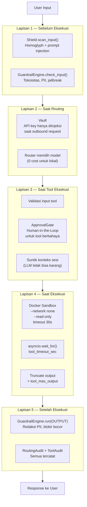

# Flow 8: Security — Lapisan Keamanan Berlapis

> **Cerita:** Setiap input dan output melewati beberapa lapis keamanan. Dari shield scan
> (deteksi prompt injection) -> guardrails (toksisitas/PII) -> vault (credential aman) ->
> approval gate (HITL untuk tool berbahaya) -> container sandbox (isolasi eksekusi kode).
> Prinsip: pertahanan berlapis, tidak ada satu titik kegagalan.

---

## Arsitektur Keamanan Berlapis



---

## Lapisan 1: Shield + Guardrails Input

### Shield — Deteksi Prompt Injection

**File:** `security/shield.py` -> `Shield`

```python
class Shield:
    def scan_input(self, text: str) -> dict:
        # 1. NFKD normalize (cegah homoglyph: "systеm" vs "system")
        normalized = unicodedata.normalize("NFKD", text)
        # 2. Deteksi pola injeksi: "ignore previous instructions", "SYSTEM:", dll
        # 3. Deteksi encoding ganda: base64, hex, unicode escape
        # 4. Return {"blocked": bool, "reason": str}
```

**Catatan penting (CLAUDE.md §17):** Shield adalah **lapisan kosmetik**. Pertahanan utama
adalah container isolation (Lapisan 4). Jangan beri rasa aman palsu.

### Guardrails Input — NeMo-Style

**File:** `security/guardrails.py` -> `GuardrailEngine`

```python
class GuardrailEngine:
    def __init__(self, enabled: dict):
        # enabled = {"toxicity": True, "pii": False, "jailbreak": True, ...}
        self.rails = {
            RailStage.INPUT: [
                ToxicityRail() if enabled.get("toxicity"),
                PIIRail() if enabled.get("pii"),
                JailbreakRail() if enabled.get("jailbreak"),
            ],
            RailStage.OUTPUT: [
                PIIRail() if enabled.get("pii"),
                BlocklistRail() if enabled.get("blocklist"),
            ],
        }

    def check_input(self, text: str) -> RailOutcome:
        for rail in self.rails[RailStage.INPUT]:
            outcome = rail.check(text)
            if outcome.blocked:
                return outcome  # STOP
        return RailOutcome(blocked=False)

    def run(self, stage: RailStage, text: str) -> RailOutcome:
        # Untuk OUTPUT: kumpulkan semua hasil, redaksi jika perlu
        modified = text
        findings = []
        for rail in self.rails[stage]:
            outcome = rail.check(modified)
            if outcome.blocked:
                return outcome
            if outcome.modified:
                modified = outcome.text
                findings.extend(outcome.findings)
        return RailOutcome(modified=True if findings else False, text=modified, findings=findings)
```

**Konfigurasi on/off per rail** disimpan di `app_settings` -> bisa diubah via `/settings` tanpa restart.

---

## Lapisan 2: Vault — Credential Aman

**File:** `security/vault.py` -> `Vault`

**Prinsip (CLAUDE.md §1.2):** Credential tidak pernah masuk context/prompt. Hanya diinjeksi
saat outbound request via Vault.

```python
class Vault:
    def __init__(self):
        # Baca dari environment variable
        self._keys = {
            "ANTHROPIC_API_KEY": os.environ.get("ANTHROPIC_API_KEY", ""),
            "GOOGLE_API_KEY": os.environ.get("GOOGLE_API_KEY", ""),
            "OPENAI_API_KEY": os.environ.get("OPENAI_API_KEY", ""),
        }

    def get(self, key: str) -> str:
        """Ambil API key. Tidak pernah di-log atau masuk ke context."""
        return self._keys.get(key, "")

    def has(self, key: str) -> bool:
        return bool(self._keys.get(key))
```

**Penggunaan di LLMClient:**
```python
# Di _claude():
api_key = self.vault.get("ANTHROPIC_API_KEY")
headers = {"x-api-key": api_key, "anthropic-version": "2023-06-01"}
# API key diambil TEPAT SEBELUM request, tidak di-cache lebih lama dari perlu
```

---

## Lapisan 3: Approval Gate (Human-in-the-Loop)

**File:** `security/approval.py` -> `ApprovalGate`

Detail lengkap ada di `tool-execution.md`. Ringkasan:

| Tool | requires_approval | Alasan |
|---|---|---|
| `file_write`, `file_edit`, `file_append`, `apply_patch` | Ya | Modifikasi file |
| `shell_run` | Ya | Eksekusi shell |
| `code_run` | Ya | Eksekusi kode (via Docker) |
| `http_request` | Ya | Request ke luar |
| `db_query` | Ya | Query DB |
| `file_read`, `list_dir`, `glob`, `grep` | Tidak | Read-only |
| `web_fetch`, `web_search` | Tidak | Read-only |

**Autopilot mode:** Tool butuh-approval jadi proposal (tidak dieksekusi). User review nanti.

**Flow:**
1. AgentLoop panggil `ApprovalGate.request()`
2. INSERT `approval_log` (pending)
3. Buat Future, simpan di `_pending` dict
4. Frontend polling `GET /approvals`
5. User klik approve/reject -> `POST /approve` -> `Future.set_result()`
6. AgentLoop lanjut (atau dapat error jika ditolak)

---

## Lapisan 4: Docker Sandbox + Safety Net

### Docker Sandbox untuk `code_run`

**File:** `tools/code.py` -> `CodeRunTool`

```
docker run --rm \
    --network none \
    --read-only \
    --memory=256m \
    --cpus=1 \
    -v /tmp/openclawn_sandbox:/workspace:exec \
    openclawn-sandbox:latest \
    timeout 30 python3 -c "{code}"
```

| Parameter | Arti |
|---|---|
| `--network none` | Tidak ada akses internet |
| `--read-only` | Filesystem read-only (kecuali /workspace) |
| `--memory=256m` | Batas memori 256MB |
| `--cpus=1` | 1 CPU core |
| `timeout 30` | Mati otomatis setelah 30 detik |
| Non-root user | Tidak ada akses root di container |

### Safety Net di `_execute_tool()`

```python
try:
    result = await asyncio.wait_for(
        tool.execute(...), timeout=self.config.tool_timeout_sec  # 30s
    )
except asyncio.TimeoutError:
    result = {"error": "timeout"}
except Exception as exc:
    result = {"error": str(exc)}
```

---

## Lapisan 5: Guardrails Output + Audit

### Guardrails Output

**File:** `security/guardrails.py` -> `GuardrailEngine.run(RailStage.OUTPUT, ...)`

Berjalan pada `turn.content` LENGKAP setelah tool loop selesai:

- **PII detection:** cari email, API key, token, nomor telepon -> redaksi jadi `[REDACTED]`
- **Blocklist:** cek terhadap daftar kata/pattern yang diblokir

**Keterbatasan jujur:** Token sudah di-stream ke UI (SSE real-time) — tidak bisa ditarik.
Guardrails output bekerja pada konten yang akan **disimpan ke history & memori**. Versi
teredaksi yang disimpan, versi asli sudah terlanjur tampil di UI.

### Audit Trail

Semua keputusan dan aksi dicatat:

| Tabel | Isi | Untuk apa |
|---|---|---|
| `routing_events` | Setiap keputusan router + koreksi | Calibration, debugging |
| `tool_invocations` | Setiap eksekusi tool + outcome | Telemetri, debugging |
| `approval_log` | Setiap approval + decision | Audit keamanan |
| `calibration_log` | Setiap perubahan offset | Riwayat kalibrasi |

---

## Ringkasan: Pertahanan Berlapis

| Lapisan | Komponen | Melindungi dari | Jika Gagal |
|---|---|---|---|
| 1 | Shield + Guardrails Input | Prompt injection, homoglyph, toksisitas | Input berbahaya masuk ke pipeline |
| 2 | Vault | Credential leak ke context/prompt | API key terekspos |
| 3 | Approval Gate | Tool destruktif dieksekusi tanpa izin | File tertimpa, shell dijalankan |
| 4 | Docker Sandbox + Timeout | Code execution sembarangan, resource hog | Host kena dampak |
| 5 | Guardrails Output + Audit | PII leak di history, data tak teraudit | Data sensitif tersimpan permanen |

**Prinsip utama (CLAUDE.md §1.1):** Jangan pernah bergantung pada satu lapisan.
Container isolation (L4) adalah pertahanan utama; Shield (L1) adalah kosmetik.
Credential tidak pernah di-log (L2); Approval Gate (L3) adalah jaring pengaman sosial.
