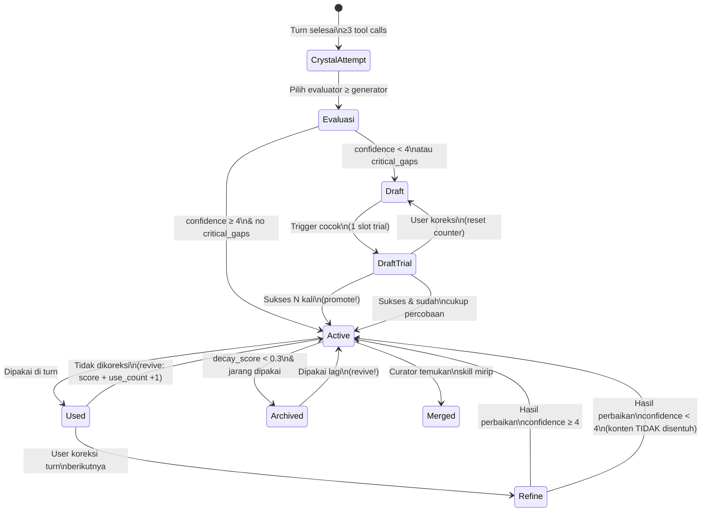

# Flow 2: Skill Crystallization — Dari Solusi Jadi Skill

> **Cerita:** Agent menjalankan tool berkali-kali untuk menyelesaikan tugas user. Solusi yang
> dihasilkan dinilai sendiri oleh evaluator (model AI yang ≥ setara generator). Jika dinilai
> cukup baik → disimpan sebagai **skill** yang bisa dipakai di turn mendatang. Inovasi 3:
> confidence threshold, evaluator gating, draft→active promotion.

---

## Ringkasan Flow

```
Turn Selesai (≥3 tool calls)
    │
    ▼
┌──────────────────────────────────────────────────────┐
│  1. should_attempt() — cek apakah layak crystallize   │
│      → total tool calls ≥ MIN_TOOL_CALLS (3)?         │
│      → Tidak? → skip (tidak ada skill baru)           │
│      → Ya? → lanjut                                   │
├──────────────────────────────────────────────────────┤
│  2. Pilih Evaluator — siapa yang menilai?             │
│      → EVALUATOR_FOR[generator_model]                 │
│      → Evaluator HARUS ≥ setara generator              │
│      → Contoh: Sonnet punya solusi → Sonnet nilai     │
├──────────────────────────────────────────────────────┤
│  3. Self-Evaluation — LLM menilai solusi sendiri       │
│      → Prompt: nilai confidence 1-5, critical_gaps?   │
│      → Output JSON ketat                               │
│      → Parse gagal? → fail-safe: confidence=1          │
├──────────────────────────────────────────────────────┤
│  4. Tentukan Status                                   │
│      → confidence ≥ 4 DAN no critical_gaps → "active" │
│      → lainnya → "draft"                              │
├──────────────────────────────────────────────────────┤
│  5. Simpan ke DB                                       │
│      → INSERT INTO skills (...)                        │
│      → INSERT INTO crystallization_log (...)            │
│      → UNIQUE constraint? → "duplicate" (skip)        │
└──────────────────────────────────────────────────────┘
    │
    ▼
Skill siap dipakai di turn berikutnya
    (jika active → auto-masuk context L3;
     jika draft → 1 slot trial jika trigger cocok)
```

---

## Langkah Detail

### 🎬 Pemicu: Post-Turn

**File:** `core/agent_loop.py` → `_post_turn()` (background task)

```python
# agent_loop.py baris ~700
if self.crystallizer.should_attempt(history_snapshot):
    await self.crystallizer.crystallize(
        task=user_message,
        solution=turn.content,
        history=history_snapshot,
        generator_model=turn.model_used,
    )
```

Hanya berjalan **setelah** turn selesai, di background task. Tidak memblokir response ke user.

---

### 1. `should_attempt()` — Syarat Minimum

**File:** `core/crystallizer.py`

```python
def should_attempt(self, history: list) -> bool:
    tool_calls = sum(len(t.tool_calls) for t in history if t.tool_calls)
    return tool_calls >= MIN_TOOL_CALLS  # = 3
```

**Logika:** Jika agent hanya jawab teks tanpa tool, tidak ada yang bisa di-crystallize. Butuh minimal 3 tool calls dalam satu turn agar solusi dianggap cukup kompleks untuk disimpan sebagai skill.

---

### 2. Pilih Evaluator — Aturan KRITIS

**File:** `core/crystallizer.py` — `EVALUATOR_FOR`

```python
EVALUATOR_FOR: dict[str, tuple[str, str]] = {
    "gemma4:e2b":             ("ollama",    "gemma4:e4b"),
    "gemma4:e4b":             ("ollama",    "gemma4:12b"),
    "gemma4:12b":             ("anthropic", "claude-haiku-4-5-20251001"),
    "claude-haiku-4-5-20251001": ("anthropic", "claude-haiku-4-5-20251001"),
    "claude-sonnet-4-6":      ("anthropic", "claude-sonnet-4-6"),
}
DEFAULT_EVALUATOR = ("anthropic", "claude-haiku-4-5-20251001")
```

**Aturan emas (Audit #4):** Evaluator **minimal setara** generator. Sebuah solusi yang dihasilkan `claude-sonnet-4-6` TIDAK boleh dinilai oleh `gemma4:e4b` (7B) — sonnet akan selalu kelihatan "sempurna" di mata model kecil. Integrity evaluasi bergantung pada ini.

**Cara pilih:**
```python
eval_provider, eval_model = EVALUATOR_FOR.get(generator_model, DEFAULT_EVALUATOR)
```

---

### 3. Self-Evaluation via LLM

**File:** `core/crystallizer.py` → `_self_evaluate()`

```python
async def _self_evaluate(self, task, solution, provider, model) -> dict:
```

**Prompt ke evaluator (ringkasan):**
```
Evaluasi solusi berikut untuk task ini.

Task: {task}
Solusi: {solution}

Berikan penilaian dalam format JSON SAJA:
{
  "confidence": <1-5>,
  "critical_gaps": <true/false>,
  "reasoning": "<1 kalimat alasan>"
}
```

**Fail-safe:**
```python
def _parse(self, raw: str) -> dict:
    try:
        return json.loads(raw)
    except (json.JSONDecodeError, ValueError):
        return {"confidence": 1, "critical_gaps": True, "reasoning": "parse failed"}
```

Parse gagal → confidence rendah → skill tidak masuk active. Lebih baik tidak punya skill daripada punya skill buruk.

---

### 4. Tentukan Status: Active vs Draft

```python
status = (
    "active"
    if (
        evaluation["confidence"] >= CONFIDENCE_THRESHOLD  # = 4
        and not evaluation["critical_gaps"]
    )
    else "draft"
)
```

| Confidence | Critical Gaps | Status | Masuk Context? |
|---|---|---|---|
| 5 | False | **active** | Auto, urut decay_score |
| 4 | False | **active** | Auto, urut decay_score |
| 3 | False | **draft** | 1 slot trial (jika trigger cocok) |
| 5 | True | **draft** | 1 slot trial (jika trigger cocok) |
| 1 | True | **draft** | 1 slot trial (jika trigger cocok) |

---

### 5. Simpan ke Database

**INSERT ke `skills`:**
```python
await self.db.execute("""
    INSERT INTO skills (role, skill_name, trigger_pattern, skill_content,
                        status, confidence, generator_model, decay_score)
    VALUES (?,?,?,?,?,?,?,1.0)
""", (self.role, skill_name, task[:60], content, status,
      evaluation["confidence"] / 5.0, generator_model))
```

- `decay_score` mulai 1.0 (baru lahir, belum decay)
- `skill_name` = 5 kata pertama task (di-slug)
- `trigger_pattern` = 60 karakter pertama task

**INSERT ke `crystallization_log` (observability):**
```python
await self._log_attempt(skill_name, generator_model, eval_model, status, evaluation)
```

Ini penting — tabel `crystallization_log` membuat **keputusan evaluator kasat mata** di halaman `/skills`. Tanpa ini, user tidak tahu kenapa suatu skill jadi draft.

**Jika skill sudah ada (UNIQUE constraint):**
```python
except Exception as e:
    # UNIQUE constraint → duplicate
    await self._log_attempt(skill_name, generator_model, eval_model, "duplicate", evaluation)
    return {"skill_name": skill_name, "status": "duplicate"}
```

---

## Skill Feedback — Compounding Intelligence (I2/I3)

**File:** `memory/skill_feedback.py` → `SkillFeedback`

Setelah skill tersimpan, feedback loop bekerja **lintas turn**:

### `record_usage(session_id, used_ids)`
Dipanggil post-turn: catat skill mana yang dipakai di turn ini.

### `resolve_previous(session_id, corrected, correction_trace)`
Dipanggil **awal turn berikutnya**: jika turn sebelumnya dikoreksi user → skill yang dipakai di turn itu harus dievaluasi:

```python
async def resolve_previous(self, session_id, corrected, correction_trace):
    used = self._usage.pop(session_id, [])
    if not used:
        return
    for skill_id in used:
        if corrected:
            # User mengoreksi → skill mungkin menyesatkan
            # 1. Reset draft counter
            await self.decay.record_draft_outcome(skill_id, success=False)
            # 2. Jika skill active, refine kontennya
            await self.crystallizer.refine_on_correction(skill_id, correction_trace)
        else:
            # Sukses → revive/promote
            await self.decay.record_draft_outcome(skill_id, success=True)
```

---

## Refine on Correction — Memperbaiki Skill

**File:** `core/crystallizer.py` → `refine_on_correction()`

Saat skill yang dipakai ternyata menyesatkan (turn-nya dikoreksi):

```python
async def refine_on_correction(self, skill_id: int, correction_trace: str) -> dict:
```

1. Ambil konten skill dari DB
2. Evaluator ≥ generator menulis ulang konten (prompt: "Perbaiki skill ini berdasarkan koreksi user")
3. Jika hasil `improved && confidence ≥ threshold`:
   - Simpan konten **lama** ke `skill_versions` (revertible)
   - `version += 1`
   - UPDATE konten skill
4. Jika confidence rendah → konten **TIDAK disentuh** (fail-safe — jangan belajar dari sinyal lemah)

---

## Draft → Active: Trial & Promotion

**File:** `memory/skill_decay.py` → `record_draft_outcome()`

Draft skill mendapat **1 slot trial** per turn (lihat `get_active_skills`). Setiap kali dipakai:

```python
async def record_draft_outcome(self, skill_id, success):
    row = await self.db.fetchone("SELECT status, draft_success_count FROM skills WHERE id=?", (skill_id,))
    if not row or row["status"] != "draft":
        return {"action": "noop"}

    if not success:
        # Koreksi → reset counter
        await self.db.execute("UPDATE skills SET draft_success_count=0 WHERE id=?", (skill_id,))
        return {"action": "reset"}

    new_count = (row["draft_success_count"] or 0) + 1
    if new_count >= self.config.draft_promote_uses:
        # PROMOTE ke active!
        await self.db.execute(
            "UPDATE skills SET status='active', draft_success_count=?, confidence=? WHERE id=?",
            (new_count, max(row["confidence"], self.config.confidence_threshold / 5.0), skill_id)
        )
        return {"action": "promoted", "uses": new_count}
    else:
        # Increment, masih draft
        await self.db.execute("UPDATE skills SET draft_success_count=? WHERE id=?", (new_count, skill_id))
        return {"action": "incremented", "uses": new_count}
```

**Syarat promote:** `draft_success_count ≥ draft_promote_uses` (dari config). Satu sukses = +1, satu koreksi = reset ke 0.

---

## Diagram Lengkap Siklus Hidup Skill



---

## Tabel yang Disentuh

| Tabel | Operasi | Kapan |
|---|---|---|
| `skills` | INSERT (baru) | Crystallize sukses |
| `skills` | UPDATE status, draft_success_count (promote/reset) | `record_draft_outcome` |
| `skills` | UPDATE decay_score, use_count, last_used_at (revive) | `mark_used` / `mark_many_used` |
| `skills` | UPDATE content, version (refine) | `refine_on_correction` |
| `skills` | UPDATE status='archived' | Decay pass |
| `crystallization_log` | INSERT (tiap attempt) | `_log_attempt` |
| `skill_versions` (implisit di skill_content backup) | INSERT (konten lama) | `refine_on_correction` |

---

## TL;DR untuk Skill Crystallization

> Setelah turn selesai dengan ≥3 tool calls → crystallizer pilih evaluator yang ≥ setara generator → evaluator nilai solusi (confidence 1-5 + critical_gaps) → confidence ≥ 4 & no gaps → **active** (langsung masuk context L3); lainnya → **draft** (1 slot trial per turn). Draft yang sukses N kali berturut-turut → **promote** ke active. Active yang jarang dipakai → decay → **archived** (bisa revive jika dipakai lagi). Active yang menyesatkan → **refine** (evaluator tulis ulang, version +1, konten lama disimpan).
