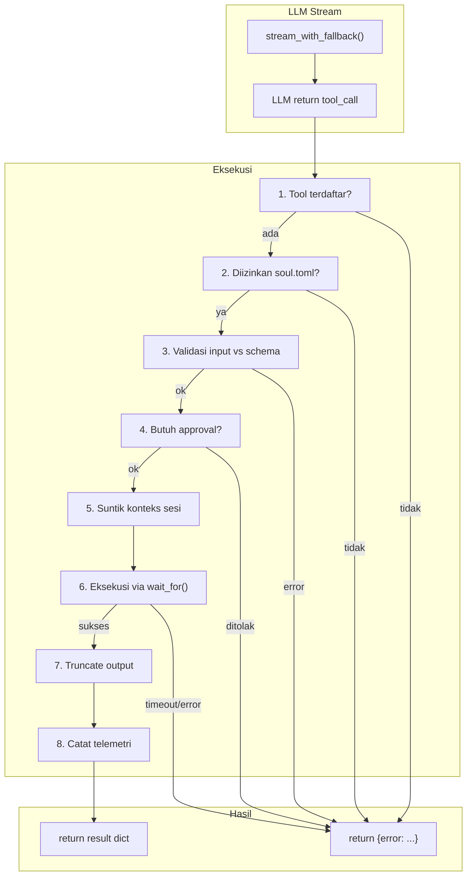
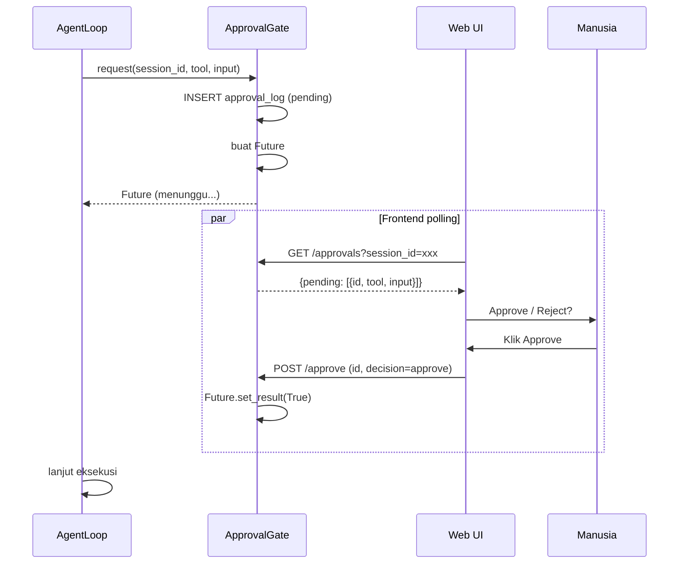

# Flow 5: Tool Execution — Dari LLM Call ke Aksi Nyata

> **Cerita:** LLM memutuskan perlu menjalankan tool (membaca file, mencari kode, menjalankan
> shell, dll). Tool tersebut harus melewati serangkaian jaring pengaman: validasi input,
> approval (jika berbahaya), eksekusi di sandbox (Docker), truncation output, dan telemetri.
> Satu tool gagal tidak menjatuhkan seluruh turn.

---

## Ringkasan Tool Loop



---

## Langkah Detail

### 0. Pemicu: LLM Minta Tool Call

**File:** `core/agent_loop.py` → `_run_tool_loop()`

```python
async for chunk in self.llm.stream_with_fallback(provider, model, messages, tools_schema):
    ...
    elif chunk.type == "tool_call":
        pending_tool = chunk  # .tool_name, .tool_input
```

**Bagaimana LLM bisa return tool call?** Dua jalur:

1. **Native (Claude/Gemini):** LLM return `tool_calls` sebagai field terstruktur.
2. **Plaintext (model GGUF lokal):** `_ollama()` me-buffer seluruh teks stream, lalu panggil `parse_plaintext_tool_calls()` di akhir untuk deteksi 7 format:

| Format | Keluarga Model | Pola Regex |
|---|---|---|
| `gemma` | Gemma 4 | `<|tool_call|>call:NAME{args}<|tool_call|>` |
| `qwen` | Qwen 2.5/3 | `<tool_call>{"name":...,"arguments":...}</tool_call>` |
| `llama3` | Llama 3.1/3.2 | `<|python_tag|>{"name":...,"parameters":...}` |
| `mistral` | Mistral/Mixtral | `[TOOL_CALLS] [{"name":...,"arguments":...}]` |
| `deepseek` | DeepSeek | `<|tool_begin|>{...}<|tool_end|>` |
| `functionary` | Functionary v3 | `<|from|>assistant...<|recipient|>NAME...<|content|>{args}` |
| `tool_code` | Generic | `<tool_code>NAME{args}</tool_code>` |

Teks dibersihkan dari token tool call sebelum dikirim ke user.

---

### 1. Cek: Tool Terdaftar?

```python
tool = TOOL_REGISTRY.get(name)
if not tool:
    return {"error": f"Tool '{name}' tidak ditemukan"}
```

**File:** `tools/__init__.py` — semua tool didaftarkan sebagai `dict`.

Daftar tool (25 total):

| Kategori | Tool | Butuh Approval |
|---|---|---|
| **Filesystem** | `file_read`, `read_many`, `file_write`, `file_edit`, `file_append`, `apply_patch` | write/edit: ya |
| **Navigation** | `list_dir`, `glob`, `grep` | tidak |
| **Documents** | `pdf_read`, `doc_write`, `pdf_write` | write: ya |
| **Git** | `git_status`, `git_diff`, `git_log` | tidak |
| **Eksekusi** | `shell_run`, `code_run` | **YA** |
| **Web** | `web_fetch`, `web_search`, `http_request` | http_request: ya |
| **Data** | `db_query`, `memory_search`, `json_query` | db_query: ya |
| **Interaksi** | `ask_user` | tidak (blocking) |
| **Manajemen** | `todo_write`, `report_blocker` | tidak |

---

### 2. Cek: Diizinkan Role?

```python
if not self._tool_allowed(name):
    return {"error": f"Tool '{name}' tidak diizinkan untuk role {self.cfg.role}"}
```

**Dari soul.toml:**
```toml
[tools]
allowed = ["file_read", "list_dir", "glob", "grep", "web_fetch",
           "ask_user", "todo_write", "report_blocker", "mcp__*"]
```

**Wildcard MCP:** Role bisa izinkan semua tool MCP dengan `mcp__*`, atau spesifik server: `mcp__github__*`.

---

### 3. Validasi Input vs Schema

```python
schema_err = _validate_tool_input(tool, input_data)
if schema_err:
    return {"error": schema_err}  # balik ke LLM agar perbaiki
```

**File:** `core/agent_loop.py` → `_validate_tool_input()`

```python
def _validate_tool_input(tool, input_data):
    schema = tool.schema().get("input_schema", {})
    required = schema.get("required", [])
    missing = [f for f in required if input_data.get(f) in (None, "")]
    if missing:
        return f"Tool '{tool.name}' butuh field: {', '.join(missing)}"
    return None
```

Sengaja **minimal** — bukan validator JSON-Schema penuh. Cukup tangkap error umum model lokal (field hilang/null).

---

### 4. Approval (Human-in-the-Loop)

**File:** `security/approval.py` → `ApprovalGate`

```python
if tool.requires_approval:
    if self.cfg.autopilot:
        # Antri sebagai PROPOSAL (tidak dieksekusi)
        await self.approval.queue_proposal(self.cfg.session_id, name, input_data)
        return {"proposed": True, "note": "Diantri untuk ditinjau user"}

    approved = await self.approval.request(self.cfg.session_id, name, input_data)
    if not approved:
        return {"error": f"Tool '{name}' ditolak oleh user"}
```

**ApprovalGate.request() flow:**
1. INSERT ke `approval_log` dengan `decision='pending'`
2. Buat `asyncio.Future()` — akan di-resolve oleh endpoint `/approve`
3. Tunggu Future (timeout = `approval_timeout_sec`)
4. Timeout -> `decision='timeout'` -> return False (ditolak)
5. User approve/reject via `/approve` -> `Future.set_result(True/False)`



---

### 5. Suntik Konteks Sesi

```python
if name in ("todo_write", "report_blocker"):
    input_data = {
        **input_data,
        "_session_id": self.cfg.session_id,
        "_role": self.cfg.role,
    }
```

Tool tertentu butuh konteks sesi yang **tidak boleh dikarang LLM**. `AgentLoop` menyuntikkan dari sumber kebenaran.

---

### 6. Eksekusi dengan Safety Net

```python
started = time.monotonic()
outcome = "ok"
try:
    result = await asyncio.wait_for(
        tool.execute(input_data, vault=self.vault, db=self.db),
        timeout=self.config.tool_timeout_sec,  # default 30s
    )
    result = self._truncate_tool_output(result)
except asyncio.TimeoutError:
    outcome = "timeout"
    result = {"error": f"Tool '{name}' melebihi batas waktu {self.config.tool_timeout_sec}s"}
except Exception as exc:
    outcome = "error"
    result = {"error": f"Tool '{name}' gagal: {exc}"}
finally:
    latency_ms = int((time.monotonic() - started) * 1000)
    await self.tool_audit.record(session_id, role, name, outcome, latency_ms)
```

**Jaring pengaman tiga lapis:**
1. **Timeout** — `asyncio.wait_for(timeout=30s)`.
2. **Exception apapun** — `except Exception` menangkap semua.
3. **Telemetri tetap dicatat** — di `finally`.

**Prinsip:** Satu tool gagal tidak menjatuhkan turn. Error dikembalikan ke LLM sebagai `{"error": "..."}`.

---

### 7. Truncate Output

```python
def _truncate_tool_output(self, result: dict) -> dict:
    limit = self.config.tool_max_output  # default ~4000 char
    out = {}
    for k, v in result.items():
        if isinstance(v, str) and len(v) > limit:
            out[k] = v[:limit] + f"\n...[dipotong, {len(v) - limit} char lagi]"
        else:
            out[k] = v
    return out
```

**Jaring akhir** — meski tiap tool sudah memotong sendiri, ini menjamin tidak ada tool yang membanjiri context window.

---

### 8. Loop Detection

```python
last_call = None
repeat_count = 0

while hop <= self.config.max_tool_hops:
    ...
    call_key = (pending_tool.tool_name, repr(sorted(pending_tool.tool_input.items())))
    if call_key == last_call:
        repeat_count += 1
        if repeat_count >= 2:  # 3x berturut-turut
            yield AgentEvent(type="status", text="loop_stopped", ...)
            break  # hard stop
    else:
        repeat_count = 0
    last_call = call_key
```

Model lokal (Gemma) suka stuck panggil tool yang sama. Hard break setelah 3 panggilan identik.

---

### Tool Khusus: `ask_user`

```python
if name == "ask_user":
    question = str(input_data.get("question", "")).strip()
    if not question:
        return {"error": "ask_user butuh field 'question'"}
    answer = await self.question_gate.ask(self.cfg.session_id, question)
    return {"answer": answer}
```

**File:** `security/question.py` -> `QuestionGate`

Pola sama `ApprovalGate`: Future, tunggu `/answer`. AgentLoop yield `status:question` dengan `detail=pertanyaan` -> UI tampilkan input -> user jawab -> Future resolved.

---

### Keamanan: `code_run` di Docker Sandbox

**File:** `tools/code.py` -> `CodeRunTool`

`code_run` memiliki `requires_approval = True` dan HANYA berjalan di Docker:

```
docker run --rm --network none --read-only --memory=256m --cpus=1 \
    -v /tmp/sandbox:/workspace:exec openclawn-sandbox:latest \
    timeout 30 python3 -c "{code}"
```

**Jaminan:**
- `--network none` — tidak ada internet
- `--read-only` — filesystem read-only
- Non-root user
- `timeout 30` — mati otomatis
- Memory & CPU dibatasi

> **Tidak ada `exec()`, `eval()`, atau `subprocess` ke host.**

---

## Tabel yang Disentuh

| Tabel | Operasi | Kapan |
|---|---|---|
| `tool_invocations` | INSERT | Setiap eksekusi tool |
| `approval_log` | INSERT | Tool butuh approval |
| `approval_log` | UPDATE | User approve/reject |
| `agent_todos` | INSERT/UPDATE/DELETE | `todo_write` tool |
| `agent_blockers` | INSERT | `report_blocker` tool |

---

## TL;DR

> LLM minta tool -> cek registrasi -> cek izin soul.toml -> validasi input (required fields)
> -> approval (Future, tunggu user via /approve, atau antri proposal di autopilot)
> -> suntik konteks sesi -> eksekusi via wait_for(timeout=30s) -> truncate output >4000 char
> -> catat telemetri ke tool_invocations. Loop detection: 3x panggil sama -> hard break.
> code_run hanya lewat Docker sandbox (--network none, --read-only).
